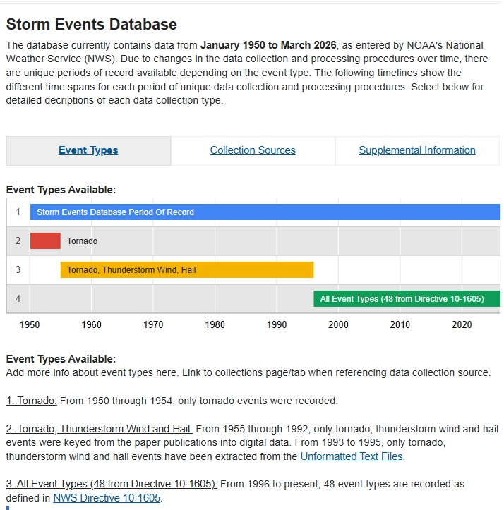
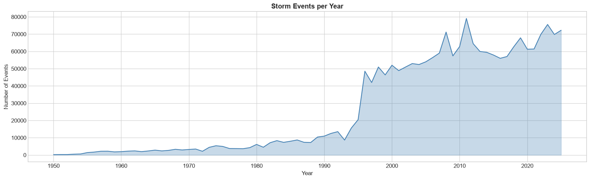
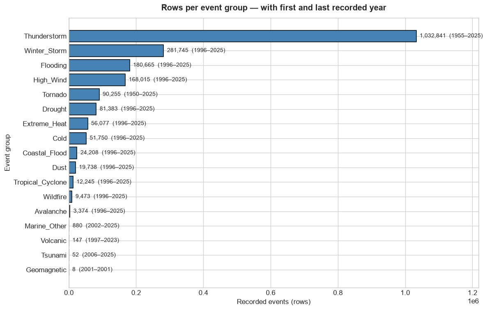
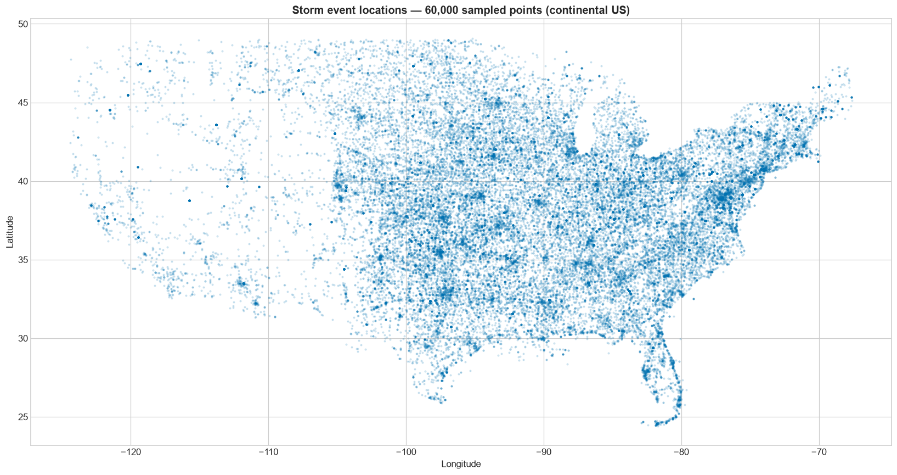

# Storm_Events

An end-to-end data pipeline for the [NOAA NCEI Storm Events Database](https://www.ncei.noaa.gov/stormevents/ftp.jsp), covering U.S. storm records from **1950 to 2025** (more than 2 million events). The pipeline merges and cleans the raw records, fills the missing narrative texts with LLM-generated ones, and enriches every event with embedding-based and LLM-derived features, producing a dataset ready for machine-learning work. 

## Data source

Storm event records are published by NOAA's National Centers for Environmental Information:

1. Open the [Storm Events Database FTP page](https://www.ncei.noaa.gov/stormevents/ftp.jsp).
2. Navigate to **HTTP access** and download the yearly CSV files (compressed in `.gz` format).

### What the source period of record actually means



This is NOAA's own description of the database, and it is the single most important thing to understand before modelling anything. The database spans 1950 to today, but **it is not one homogeneous series**, it is three different data-collection regimes stacked end to end:

- **1950–1954**: only **tornado** events were recorded.
- **1955–1995**: **tornado, thunderstorm wind and hail**.
- **1996–present**: all **48 event types** defined in [NWS Directive 10-1605](https://www.ncei.noaa.gov/stormevents/ftp.jsp) are recorded.

## Pipeline

The scripts and notebooks are numbered in the order they run.

1. **`1_extraction.py`** Extracts the individual CSV files from the downloaded `.gz` archives.
2. **`2_merge.py`** Merges the extracted CSV files, year by year, into a single raw dataset spanning 1950–2025.
3. **`3_StormEvents_Cleaning_used.ipynb`** Assesses the missing values (which columns have gaps and how the missingness is distributed over time), then cleans the raw dataset: parses the damage strings, normalises the tornado intensity scale, groups the 56 raw event types into broader **event groups**, fills missing values, and drops columns that are unpopulated or redundant. Its output is the cleaned dataset used in all subsequent steps.
4. **`4_StormEvents_filling_text_generation_used.py`** Identifies every event missing an `EPISODE_NARRATIVE` or `EVENT_NARRATIVE` and generates the missing text with OpenAI's **`gpt-4o-mini`** through the **Batch API**. Rows that already have both narratives are never sent, and when one narrative exists it is passed to the model as context so the generated text stays consistent with it. The structured fields of the row (event type, state, dates, magnitude, damages, casualties…) are supplied as grounding context so the generated narrative is factual rather than invented.
5. **`5_StormEvents_embedding_augmentation_used.py`** Encodes the episode and event narratives with the **`all-MiniLM-L12-v2`** sentence-transformer model and applies dimensionality reduction, turning the free text into a compact set of numeric embedding features usable alongside the tabular columns. Embeddings could also be produced through the OpenAI API — GPT-family models, but `gpt-4o-mini` itself is used as a generative endpoint that returns text, not vectors. A local sentence-transformer was preferred here because it is purpose-built for sentence-level embeddings, producing a fixed-length numeric vector that captures each narrative's meaning, exactly the form needed for machine-learning features. 

   One could object that OpenAI's embedding models return richer vectors (1,536 dimensions or more, against MiniLM's 384) and should therefore capture more nuance. In this pipeline that advantage would be lost: the embeddings are not used raw but compressed by TruncatedSVD down to **10 components per narrative** (`ep_embedding_1..10`, `ev_embedding_1..10`), so both models funnel into the same small feature set and the extra dimensions would mostly be discarded. Vector size is also not a quality measure in itself. `all-MiniLM-L12-v2` scores strongly on sentence-similarity benchmarks despite its compact size, and the storm narratives are short weather descriptions that a compact model represents well. For this use case the larger vectors would add API cost and processing time without a measurable gain in the final 10 features.
6. **`6_StormEvents_feature_augmentation_used.py`** Asks `gpt-4o-mini`, again through the Batch API, to read each `EPISODE_NARRATIVE` and answer three questions, adding one categorical column per answer:

   | New column | Question the LLM answers | Possible answers |
   |---|---|---|
   | `risk` | How dangerous was the episode? | high / medium / low |
   | `impact_type` | What was mainly affected? | casualties / property_damage / crop_damage / infrastructure_disruption / no_significant_impact |
   | `event_scope` | How large an area was affected? | localized / county-wide / regional / widespread |

   Each label is defined explicitly in the system prompt (e.g. `high` = deaths, injuries or major destruction occurred or were clearly likely) so the classification stays consistent across the whole dataset, and the model is instructed to judge only what the text states rather than assume unmentioned impacts.
7. **`7_export_github.py`** Splits the datasets into compressed Parquet parts small enough for GitHub and writes them to the `data/` folder.
8. **`8_EDA_used.ipynb`** Exploratory analysis of the final dataset: coverage over time, event-group composition, geography, damage and casualty trends, stationarity and seasonality of the monthly series, and the categorical drivers of impact. Some pictures below come from this notebook.

## What the data looks like

### Events per year



The yearly event count is flat and low (a few thousand per year) through the 1950s–1980s, then rises through the early 1990s and **jumps almost fourfold between 1995 and 1996**, from roughly 9,000 to nearly 50,000 events. That vertical wall is not a climate signal: it is the 1996 switch to recording all 48 event types described above. After 1996 the series settles into a genuine range of roughly 50,000–80,000 events per year, with the peaks (2008, 2011, 2023–2025) reflecting real, severe storm seasons.

### Composition by event group



The 56 raw NOAA event types are collapsed into 17 broader **event groups**. The chart shows how many rows each group holds and the first/last year it appears, and it makes two things immediately clear.

First, the distribution is extremely **imbalanced**. `Thunderstorm` alone accounts for about 1.03 million rows, more than half the dataset. At the other end, `Geomagnetic` has 8 rows, `Tsunami` 52 and `Volcanic` 147. 

Second, the **start years confirm the collection-regime story**: `Tornado` starts in 1950 and `Thunderstorm` in 1955, while nearly every other group starts in exactly 1996. A few start even later simply because the phenomenon is rare or was catalogued later (`Marine_Other` 2002, `Tsunami` 2006).

### Geographic distribution



A 60,000-point sample of event coordinates over the continental U.S. The density map matches known U.S. severe-weather climatology: a dense core across the Great Plains and the Midwest into the Southeast (Tornado Alley and Dixie Alley), heavy coverage along the Gulf and Atlantic coasts and the Florida peninsula, and a comparatively sparse, clustered West where events concentrate around populated valleys and mountain corridors.

Part of that east/west contrast is meteorological and part is **reporting bias**: storm events are recorded when someone observes and reports them, so sparsely populated areas generate fewer records for the same weather. 

## Data files

The `data/` folder contains two datasets, each split into Parquet parts (zstd-compressed) to respect GitHub's file-size limits:

- **`StormEvents_part_1..5.parquet`** The raw merged dataset (output of step 2).
- **`StormEvents_fe_ep_augmentation_fin_part_1..10.parquet`** The final dataset with generated narratives, embedding features, and the three LLM-derived columns (output of step 6).

To reassemble a dataset, concatenate its parts in order:

```python
import glob
import pandas as pd

parts = sorted(glob.glob("data/StormEvents_fe_ep_augmentation_fin_part_*.parquet"))
df = pd.concat([pd.read_parquet(p) for p in parts], ignore_index=True)
```
