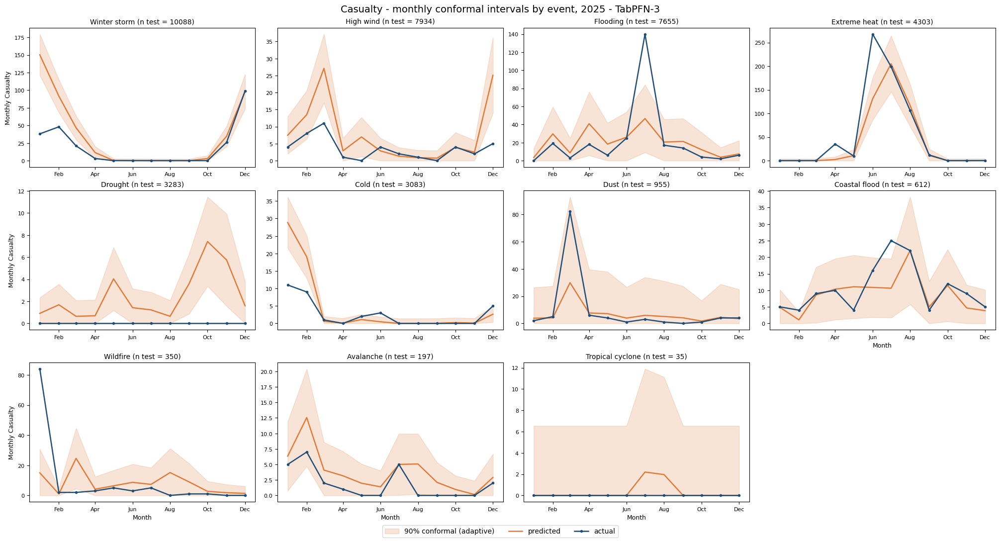
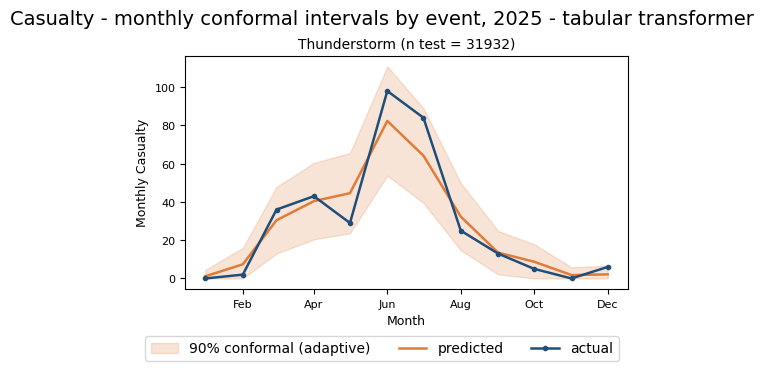
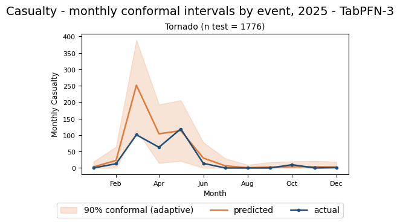

# Storm_Events

An end-to-end data pipeline for the [NOAA NCEI Storm Events Database](https://www.ncei.noaa.gov/access/storm-events-database), covering U.S. storm records from **1950 to 2025** (more than 2 million events). The pipeline merges and cleans the raw records, fills the missing narrative texts with LLM-generated ones, and enriches every event with embedding-based and LLM-derived features, producing a dataset ready for machine-learning work. 

## Data source

Storm event records are published by NOAA's National Centers for Environmental Information:

1. Open the [Storm Events Database FTP page](https://www.ncei.noaa.gov/pub/data/swdi/stormevents/csvfiles/).
2. Navigate to **HTTP access** and download the yearly CSV files (compressed in `.gz` format).

### What the source period of record actually means


This is NOAA's own description of the database, and it is the single most important thing to understand before modelling anything. The database spans 1950 to today, but **it is not one homogeneous series**, it is three different data-collection regimes stacked end to end:

- **1950–1954**: only **tornado** events were recorded.
- **1955–1995**: **tornado, thunderstorm wind and hail**.
- **1996–present**: all **48 event types** defined in [NWS Directive 10-1605](https://www.ncei.noaa.gov/access/storm-events-database/about) are recorded.

## Pipeline

The scripts and notebooks are numbered in the order they run.

1. **`1_extraction.py`** Extracts the individual CSV files from the downloaded `.gz` archives.
2. **`2_merge.py`** Merges the extracted CSV files, year by year, into a single raw dataset spanning 1950–2025.
3. **`3_StormEvents_Cleaning_used.ipynb`** Assesses the missing values (which columns have gaps and how the missingness is distributed over time), then cleans the raw dataset: parses the damage strings, normalises the tornado intensity scale, groups the 56 raw event types into broader **event groups**, fills missing values, and drops columns that are unpopulated or redundant. Its output is the cleaned dataset used in all subsequent steps.
4. **`4_StormEvents_filling_text_generation_used.py`** Identifies every event missing an `EPISODE_NARRATIVE` or `EVENT_NARRATIVE` and generates the missing text with OpenAI's **`gpt-4o-mini`** through the **Batch API**. Rows that already have both narratives are never sent, and when one narrative exists it is passed to the model as context so the generated text stays consistent with it. The structured fields of the row (event type, state, dates, magnitude, damages, casualties…) are supplied as grounding context so the generated narrative is factual rather than invented.
5. **`5_StormEvents_embedding_augmentation_used.py`** Encodes the episode and event narratives with the **`all-MiniLM-L12-v2`** sentence-transformer model and applies dimensionality reduction, turning the free text into a compact set of numeric embedding features usable alongside the tabular columns. Embeddings could also be produced through the OpenAI API, GPT-family models, but `gpt-4o-mini` itself is used as a generative endpoint that returns text, not vectors. A local sentence-transformer was preferred here because it is purpose-built for sentence-level embeddings, producing a fixed-length numeric vector that captures each narrative's meaning, exactly the form needed for machine-learning features. 

   One could object that OpenAI's embedding models return richer vectors (1,536 dimensions or more, against MiniLM's 384) and should therefore capture more nuance. In this pipeline that advantage would be lost: the embeddings are not used raw but compressed by TruncatedSVD down to **10 components per narrative** (`ep_embedding_1..10`, `ev_embedding_1..10`), so both models funnel into the same small feature set and the extra dimensions would mostly be discarded. Vector size is also not a quality measure in itself. `all-MiniLM-L12-v2` scores strongly on sentence-similarity benchmarks despite its compact size, and the storm narratives are short weather descriptions that a compact model represents well. For this use case the larger vectors would add API cost and processing time without a measurable gain in the final 10 features.
6. **`6_StormEvents_feature_augmentation_used.py`** Asks `gpt-4o-mini`, again through the Batch API, to read each `EPISODE_NARRATIVE` and answer two questions, adding one categorical column per answer:

   | New column | Question the LLM answers | Possible answers |
   |---|---|---|
   | `risk` | How dangerous was the episode? | high / medium / low |
   | `event_scope` | How large an area was affected? | localized / county-wide / regional / widespread |

   Each label is defined explicitly in the system prompt (e.g. `high` = deaths, injuries or major destruction occurred or were clearly likely) so the classification stays consistent across the whole dataset, and the model is instructed to judge only what the text states rather than assume unmentioned impacts.
7. **`7_export_github.py`** Splits the datasets into compressed Parquet parts small enough for GitHub and writes them to the `data/` folder.
8. **`8_EDA_used.ipynb`** Exploratory analysis of the final dataset: coverage over time, event-group composition, geography, damage and casualty trends, stationarity and seasonality of the monthly series, and the categorical drivers of impact. Some pictures below come from this notebook.
9. **`9_Global_prediction_count_v2.ipynb`**, **`9_Thunderstorm_prediction_count_v2.ipynb`**, **`9_Tornado_prediction_count_v2b.ipynb`** Three parallel modelling notebooks that share one design and differ only in the slice of the database they cover. The split follows the collection-regime problem described above: Tornado and Thunderstorm have event records long before 1996, so they are modelled separately, while the remaining event groups are modelled together from 1996 onward.

   | Notebook | Scope | Period | Events 
   |---|---|---|---|
   | `9_Global_…` | the 11 event groups left after removing Tornado, Thunderstorm and the four almost-empty groups (`Geomagnetic`, `Volcanic`, `Tsunami`, `Marine_Other`) | 1996–2025 | 888,673 
   | `9_Thunderstorm_…` | `Thunderstorm` | 1955–2025 | 1,032,841 
   | `9_Tornado_…` | `Tornado` | 1950–2025 | 90,255 

   All three read the augmented dataset straight from the parquet files in `data/` and follow the same protocol. The target is a single count, **`CASUALTY`** (injuries plus deaths, direct and indirect). The data is **split by date first** (train through 2023, calibration 2024, test 2025) and only then filtered for zero-variance, redundant and high-cardinality features **using training rows alone**, so no test information reaches the design matrix. Each event also gets a set of **same-day context features** (how many events had already started that day nationwide, in the same group and in the same state, how many of them were high-risk or wide in scope, and the hours since the previous event of the same group in the same state), built from the predictors of earlier events only, never from their casualties, and one split at a time. Four models are fitted: a Poisson **GLM**, **LightGBM**, an **LSTM** and **TabPFN-3**. The GLM, LightGBM and LSTM hyperparameters are selected with expanding-window cross-validation over validation years, minimizing mean Poisson deviance; TabPFN-3 uses a fixed in-context configuration with a target-stratified context of up to 50,000 training rows. Every model is backtested on the same expanding-window folds and produces 90% adaptive conformal intervals. A last section splits the casualty prediction into injuries and deaths with a fixed share estimated on the training years, without fitting a second model.
10. **`10_Global_Tabular_Transformer_prediction_count_v2b.ipynb`**, **`10_Thunderstorm_Tabular_Transformer_prediction_count_v2.ipynb`**, **`10_Tornado_Tabular_Transformer_prediction_count_v2ff.ipynb`** A fifth model for each slice: a **tabular transformer** written directly in PyTorch. It uses the same data, date split, target, context features, metrics, conformal intervals and backtest folds as the matching `9_…` notebook, so its results can be read side by side with the other four models.
11. **`11_Global_Comparison_v2.ipynb`**, **`11_Thunderstorm_Comparison_v2.ipynb`**, **`11_Tornado_Comparison_v2b.ipynb`** Load the saved results of the five models for one slice and compare them: point metrics by split plus the mean over the backtest years, and conformal coverage and relative width. The comparison pictures below come from these notebooks.

## What the data looks like

### Events per year


The yearly event count is flat and low (a few thousand per year) through the 1950s–1980s, then rises through the early 1990s and **jumps almost fourfold between 1995 and 1996**, from roughly 9,000 to nearly 50,000 events. That vertical wall is not a climate signal: it is the 1996 switch to recording all 48 event types described above. After 1996 the series settles into a genuine range of roughly 50,000–80,000 events per year, with the peaks (2008, 2011, 2023–2025) reflecting real, severe storm seasons.

### Composition by event group


The 56 raw NOAA event types are collapsed into 17 broader **event groups**. The chart shows how many rows each group holds and the first/last year it appears, and it makes two things immediately clear.

First, the distribution is extremely **imbalanced**. `Thunderstorm` alone accounts for about 1.03 million rows, more than half the dataset. At the other end, `Geomagnetic` has 8 rows, `Tsunami` 52 and `Volcanic` 147. 

Second, the **start years confirm the collection-regime story**: `Tornado` starts in 1950 and `Thunderstorm` in 1955, while nearly every other group starts in exactly 1996. A few start even later simply because the phenomenon is rare or was catalogued later (`Marine_Other` 2002, `Tsunami` 2006).

### Geographic distribution


A 60,000-point sample of event coordinates over the continental U.S. The density map matches known U.S. severe-weather climatology: a dense core across the Great Plains and the Midwest into the Southeast (Tornado Alley and Dixie Alley), heavy coverage along the Gulf and Atlantic coasts and the Florida peninsula, and a comparatively sparse, clustered West where events concentrate around populated valleys and mountain corridors.

Part of that east/west contrast is meteorological and part is **reporting bias**: storm events are recorded when someone observes and reports them, so sparsely populated areas generate fewer records for the same weather. 

## Casualty-Count Modeling results

The unit of analysis is the **single storm event**: one row, one event. The target is **`CASUALTY`**, the total number of people injured or killed by the event (direct and indirect). Every model returns the **expected number of casualties for that event**, conditional on its characteristics and on what had already happened earlier the same day, with a Poisson objective (TabPFN-3 works on a transformed casualty rate and returns predictions on the count scale).

Models are ranked on **D2** (Poisson pseudo-R², high = better) and **mean Poisson deviance** (MPD, low = better), the two metrics consistent with the Poisson objective. RMSE appears in the comparison charts but is not used: squared errors are dominated by a handful of catastrophic events. MPD is on the scale of each slice, so it compares models within one slice, not across them. For the intervals, event-level predictions are summed by day and the 90% adaptive conformal interval is checked against the daily casualty total of 2025: **coverage** should sit near 0.90, and **RelWidth** (mean band width over mean daily actual) says how tight the band is.

**How the best model is chosen.** The 2025 test split is a single year. The **backtest** refits every model on five expanding-window folds (train ≤ 2018 → predict 2019, …, train ≤ 2022 → predict 2023), so its mean D2 and mean MPD are the main criterion; the 2025 test and the interval width break ties. The backtest means are the last column of each comparison chart.

| Slice | Best model | Backtest D2 | Backtest MPD | 2025 test D2 | 2025 test MPD | Coverage | RelWidth |
|---|---|---|---|---|---|---|---|
| Global | **TabPFN-3** | 0.45 | 0.341 | 0.58 | 0.184 | 0.92 | 2.06 |
| Thunderstorm | **Transformer** | 0.46 | 0.0775 | 0.50 | 0.0608 | 0.92 | 2.46 |
| Tornado | **TabPFN-3** | 0.65 | 1.26 | 0.32 | 0.89 | 0.93 | 2.20 |

The 2025 interval charts below are the best model's for each slice: monthly totals of the event-level predictions with the 90% adaptive conformal band, one panel per event group.

### Global — 11 event groups, 1996–2025


| Metric | GLM | LightGBM | LSTM | TabPFN-3 | Transformer |
|---|---|---|---|---|---|
| backtest D2 | 0.32 | 0.43 | 0.39 | **0.45** | 0.42 |
| backtest MPD | 0.431 | 0.364 | 0.386 | **0.341** | 0.364 |
| 2025 D2 | 0.41 | 0.56 | 0.42 | **0.58** | 0.57 |
| 2025 MPD | 0.255 | 0.192 | 0.250 | **0.184** | 0.188 |
| Coverage | 0.92 | 0.91 | 0.92 | 0.92 | 0.92 |
| RelWidth | 2.42 | **1.65** | 1.86 | 2.06 | 1.71 |

- **TabPFN-3 is the best model:** it leads on both backtest metrics and on 2025, and has the lowest backtest MPD in 3 of 5 years (LightGBM wins the other two). The transformer is a close second on 2025 (MPD 0.188).
- **2023 is hard for every model:** MPD is 0.60–0.86, against 0.20–0.28 in 2019–2021.
- **Intervals:** coverage is 0.91–0.92 for every model. TabPFN-3 pays for its accuracy with a wider band than LightGBM and the transformer (RelWidth 2.06 against 1.65 and 1.71).

#### TabPFN-3 — conformal intervals by event group, 2025



- **Tracked closely:** `Extreme_Heat` follows the summer peak, `Coastal_Flood`, `Avalanche` and `Dust` stay inside the band almost all year, and the March `Dust` spike (82) is still covered.
- **Single episodes escape the band:** the January `Wildfire` (84 casualties against a ceiling near 30), the July `Flooding` (140 against about 85) and the June `Extreme_Heat` peak (268 against about 175).
- **Over-called in winter:** `Winter_Storm` in January (150 predicted, 38 recorded), `Cold` in January–February and `High_Wind` in December fall below the band.
- `Drought` and `Tropical_Cyclone` record zero casualties in 2025. The model still expects a few, so the bands are wide, and in autumn `Drought` falls just below them.

### Thunderstorm — 1955–2025


| Metric | GLM | LightGBM | LSTM | TabPFN-3 | Transformer |
|---|---|---|---|---|---|
| backtest D2 | 0.24 | 0.43 | 0.43 | 0.44 | **0.46** |
| backtest MPD | 0.1092 | 0.0809 | 0.0814 | 0.0806 | **0.0775** |
| 2025 D2 | 0.25 | 0.45 | 0.43 | 0.46 | **0.50** |
| 2025 MPD | 0.0909 | 0.0674 | 0.0698 | 0.0656 | **0.0608** |
| Coverage | 0.91 | 0.92 | 0.91 | 0.92 | 0.92 |
| RelWidth | 3.90 | 2.53 | **2.46** | 3.06 | **2.46** |

- **The transformer is the best model:** it leads on every metric, has the lowest backtest MPD in 3 of 5 years (2021–2023), and ties the LSTM for the tightest band.
- LightGBM, the LSTM and TabPFN-3 are level behind it (backtest MPD 0.0806–0.0814). The GLM is at about half their D2.
- **2020 is the hardest year for every model** (MPD 0.10–0.16), reflecting that year's outbreaks.

#### Transformer — conformal intervals, 2025



- The prediction follows the seasonal shape, rising from March and peaking in June.
- **Every month is inside the band.** The June–July peak (98 and 84 recorded) is slightly under-called (82 and 64 predicted) and May is over-called (45 against 29), but all stay covered.

### Tornado — 1950–2025


| Metric | GLM | LightGBM | LSTM | TabPFN-3 | Transformer |
|---|---|---|---|---|---|
| backtest D2 | 0.50 | 0.64 | 0.58 | **0.65** | 0.60 |
| backtest MPD | 1.77 | 1.26 | 1.45 | **1.26** | 1.34 |
| 2025 D2 | 0.03 | 0.17 | 0.18 | **0.32** | 0.15 |
| 2025 MPD | 1.27 | 1.08 | 1.07 | **0.89** | 1.11 |
| Coverage | 0.92 | 0.93 | 0.93 | 0.93 | 0.93 |
| RelWidth | 3.86 | 2.73 | 2.35 | **2.20** | 2.48 |

- **TabPFN-3 is the best model:** it is level with LightGBM on the backtest (MPD 1.259 against 1.261, D2 0.65 against 0.64) and clearly ahead on 2025 (D2 0.32 against 0.15–0.18 for the other nonlinear models), with the tightest band.
- **2025 is a hard year for every model:** D2 drops from 0.58–0.65 on the backtest to 0.15–0.32, and the GLM is close to zero (0.03).
- Coverage is 0.92–0.93 for every model.

#### TabPFN-3 — conformal intervals, 2025



- **The spring outbreak season is over-called:** 252 casualties predicted in March against 101 recorded, and 104 in April against 63. March sits on the lower edge of the band.
- **May is on target** (115 predicted, 118 recorded), and the quiet months from June to December are near zero and well covered.
- The band is widest in March (up to about 390): that is when a single outbreak can move the monthly total by hundreds of casualties.

### From casualties to injuries and deaths

Each model predicts one number per event, `CASUALTY`. The `9_…` and `10_…` notebooks check whether it can be split into injuries and deaths **without a second model**, by multiplying the prediction by the share each component holds over the training years (deaths are 24% of casualties on the global slice and 6% on tornado). The split is the same for every model, so it keeps the ranking of the casualty prediction.

### Takeaways

- **No single model wins everywhere.** TabPFN-3 is the best choice on the global and tornado slices, the transformer on thunderstorm.
- **The transformer is competitive on every slice.** It is best on thunderstorm and a close second on global 2025.
- **The GLM is the floor.** It is interpretable and stable, but it trails on every slice and falls to D2 0.03 on tornado 2025.
- **Intervals are calibrated everywhere** (coverage 0.91–0.93). What they cannot catch are single catastrophic episodes: heat waves, wildfires, flash floods and outbreak months.
- **One test year can mislead.** Tornado 2025 is much harder than the backtest years for every model, so test, backtest and the monthly interval charts must be read together.

## Data files

The `data/` folder contains two datasets, each split into Parquet parts (zstd-compressed) to respect GitHub's file-size limits:

- **`StormEvents_part_1..5.parquet`** The raw merged dataset (output of step 2).
- **`StormEvents_fe_ep_augmentation_fin_update_part_1..15.parquet`** The final dataset with generated narratives, embedding features, and the LLM-derived columns (output of step 6).

To reassemble a dataset, concatenate its parts in order:

```python
import glob
import pandas as pd

parts = sorted(glob.glob("data/StormEvents_fe_ep_augmentation_fin_update_part_*.parquet"))
df = pd.concat([pd.read_parquet(p) for p in parts], ignore_index=True)
```
Compiled with the assistance by Claude Code
