# Storm_Events

An end-to-end data pipeline for the [NOAA NCEI Storm Events Database](https://www.ncei.noaa.gov/access/storm-events-database), covering U.S. storm records from **1950 to 2025** (more than 2 million events). The pipeline merges and cleans the raw records, fills the missing narrative texts with LLM-generated ones, and enriches every event with embedding-based and LLM-derived features, producing a dataset ready for machine-learning work. 

## Data source

Storm event records are published by NOAA's National Centers for Environmental Information:

1. Open the [Storm Events Database FTP page](https://www.ncei.noaa.gov/pub/data/swdi/stormevents/csvfiles/).
2. Navigate to **HTTP access** and download the yearly CSV files (compressed in `.gz` format).

### What the source period of record actually means


This is NOAA's own description of the database, and it is the single most important thing to understand before modelling anything. The database spans 1950 to today, but **it is not one homogeneous series**, it is three different data-collection regimes stacked end to end:

- **1950–1954**: only **tornado** events were recorded.
- **1955–1995**: **tornado, thunderstorm wind and hail**.
- **1996–present**: all **48 event types** defined in [NWS Directive 10-1605](https://www.ncei.noaa.gov/access/storm-events-database/about) are recorded.

## Pipeline

The scripts and notebooks are numbered in the order they run.

1. **`1_extraction.py`** Extracts the individual CSV files from the downloaded `.gz` archives.
2. **`2_merge.py`** Merges the extracted CSV files, year by year, into a single raw dataset spanning 1950–2025.
3. **`3_StormEvents_Cleaning_used.ipynb`** Assesses the missing values (which columns have gaps and how the missingness is distributed over time), then cleans the raw dataset: parses the damage strings, normalises the tornado intensity scale, groups the 56 raw event types into broader **event groups**, fills missing values, and drops columns that are unpopulated or redundant. Its output is the cleaned dataset used in all subsequent steps.
4. **`4_StormEvents_filling_text_generation_used.py`** Identifies every event missing an `EPISODE_NARRATIVE` or `EVENT_NARRATIVE` and generates the missing text with OpenAI's **`gpt-4o-mini`** through the **Batch API**. Rows that already have both narratives are never sent, and when one narrative exists it is passed to the model as context so the generated text stays consistent with it. The structured fields of the row (event type, state, dates, magnitude, damages, casualties…) are supplied as grounding context so the generated narrative is factual rather than invented.
5. **`5_StormEvents_embedding_augmentation_used.py`** Encodes the episode and event narratives with the **`all-MiniLM-L12-v2`** sentence-transformer model and applies dimensionality reduction, turning the free text into a compact set of numeric embedding features usable alongside the tabular columns. Embeddings could also be produced through the OpenAI API — GPT-family models, but `gpt-4o-mini` itself is used as a generative endpoint that returns text, not vectors. A local sentence-transformer was preferred here because it is purpose-built for sentence-level embeddings, producing a fixed-length numeric vector that captures each narrative's meaning, exactly the form needed for machine-learning features. 

   One could object that OpenAI's embedding models return richer vectors (1,536 dimensions or more, against MiniLM's 384) and should therefore capture more nuance. In this pipeline that advantage would be lost: the embeddings are not used raw but compressed by TruncatedSVD down to **10 components per narrative** (`ep_embedding_1..10`, `ev_embedding_1..10`), so both models funnel into the same small feature set and the extra dimensions would mostly be discarded. Vector size is also not a quality measure in itself. `all-MiniLM-L12-v2` scores strongly on sentence-similarity benchmarks despite its compact size, and the storm narratives are short weather descriptions that a compact model represents well. For this use case the larger vectors would add API cost and processing time without a measurable gain in the final 10 features.
6. **`6_StormEvents_feature_augmentation_used.py`** Asks `gpt-4o-mini`, again through the Batch API, to read each `EPISODE_NARRATIVE` and answer three questions, adding one categorical column per answer:

   | New column | Question the LLM answers | Possible answers |
   |---|---|---|
   | `risk` | How dangerous was the episode? | high / medium / low |
   | `event_scope` | How large an area was affected? | localized / county-wide / regional / widespread |

   Each label is defined explicitly in the system prompt (e.g. `high` = deaths, injuries or major destruction occurred or were clearly likely) so the classification stays consistent across the whole dataset, and the model is instructed to judge only what the text states rather than assume unmentioned impacts.
7. **`7_export_github.py`** Splits the datasets into compressed Parquet parts small enough for GitHub and writes them to the `data/` folder.
8. **`8_EDA_used.ipynb`** Exploratory analysis of the final dataset: coverage over time, event-group composition, geography, damage and casualty trends, stationarity and seasonality of the monthly series, and the categorical drivers of impact. Some pictures below come from this notebook.
9. **`9_Global_prediction_count_v1.ipynb`**, **`9_Thunderstorm_prediction_count_v1.ipynb`**, **`9_Tornado_prediction_count_v1.ipynb`** Three parallel modelling notebooks that share one design and differ only in the slice of the database they cover. The split follows the collection-regime problem described above: Tornado and Thunderstorm have event records long before 1996, so they are modelled separately, while the remaining event groups are modelled together from 1996 onward.

   | Notebook | Scope | Period | Events 
   |---|---|---|---|
   | `9_Global_…` | the 11 event groups left after removing Tornado, Thunderstorm and the four almost-empty groups (`Geomagnetic`, `Volcanic`, `Tsunami`, `Marine_Other`) | 1996–2025 | 888,673 
   | `9_Thunderstorm_…` | `Thunderstorm` | 1955–2025 | 1,032,841 
   | `9_Tornado_…` | `Tornado` | 1950–2025 | 90,255 

   All three read the augmented dataset straight from the parquet files in `data/` and follow the same protocol. The data is **split by date first** (train through 2023, calibration 2024, test 2025) and only then filtered for zero-variance, redundant and high-cardinality features **using training rows alone**, so no test information reaches the design matrix. Four models are fitted: a Poisson **GLM**, **LightGBM**, an **LSTM** and **TabPFN-3**. The GLM, LightGBM and LSTM hyperparameters are selected with expanding-window cross-validation over validation years, minimizing mean Poisson deviance; TabPFN-3 uses a fixed in-context configuration with a target-stratified context of up to 50,000 training rows. Every model is backtested on the same expanding-window folds and produces 90% adaptive conformal intervals.
10. **`10_Global_Tabular_Transformer_prediction_count_v1.ipynb`**, **`10_Thunderstorm_Tabular_Transformer_prediction_count_v1.ipynb`**, **`10_Tornado_Tabular_Transformer_prediction_count_v1.ipynb`** A fifth model for each slice: a **tabular transformer** written directly in PyTorch. It uses the same data, date split, targets, metrics, conformal intervals and backtest folds as the matching `9_…` notebook, so its results can be read side by side with the other four models. Some pictures below come from these notebooks.
11. **`11_Global_Comparison.ipynb`**, **`11_Thunderstorm_Comparison.ipynb`**, **`11_Tornado_Comparison.ipynb`** Load the saved results of the five models for one slice and compare them: point metrics by target and split, a metrics heatmap per model, and conformal coverage and relative width by target. The comparison pictures below come from these notebooks.

## What the data looks like

### Events per year


The yearly event count is flat and low (a few thousand per year) through the 1950s–1980s, then rises through the early 1990s and **jumps almost fourfold between 1995 and 1996**, from roughly 9,000 to nearly 50,000 events. That vertical wall is not a climate signal: it is the 1996 switch to recording all 48 event types described above. After 1996 the series settles into a genuine range of roughly 50,000–80,000 events per year, with the peaks (2008, 2011, 2023–2025) reflecting real, severe storm seasons.

### Composition by event group


The 56 raw NOAA event types are collapsed into 17 broader **event groups**. The chart shows how many rows each group holds and the first/last year it appears, and it makes two things immediately clear.

First, the distribution is extremely **imbalanced**. `Thunderstorm` alone accounts for about 1.03 million rows, more than half the dataset. At the other end, `Geomagnetic` has 8 rows, `Tsunami` 52 and `Volcanic` 147. 

Second, the **start years confirm the collection-regime story**: `Tornado` starts in 1950 and `Thunderstorm` in 1955, while nearly every other group starts in exactly 1996. A few start even later simply because the phenomenon is rare or was catalogued later (`Marine_Other` 2002, `Tsunami` 2006).

### Geographic distribution


A 60,000-point sample of event coordinates over the continental U.S. The density map matches known U.S. severe-weather climatology: a dense core across the Great Plains and the Midwest into the Southeast (Tornado Alley and Dixie Alley), heavy coverage along the Gulf and Atlantic coasts and the Florida peninsula, and a comparatively sparse, clustered West where events concentrate around populated valleys and mountain corridors.

Part of that east/west contrast is meteorological and part is **reporting bias**: storm events are recorded when someone observes and reports them, so sparsely populated areas generate fewer records for the same weather. 

## Casualty-Count Modeling results

The unit of analysis is the **single storm event**: one row, one event. There are two targets, **`INJURIES`** and **`DEATHS`**, each the sum of its direct and indirect counts. Every model returns the **expected number of casualties for that event**, conditional on its characteristics, with a Poisson objective (TabPFN-3 works on a transformed casualty rate and returns predictions on the count scale).

Models are ranked on **D2** (Poisson pseudo-R², high = better) and **mean Poisson deviance** (MPD, low = better), the two metrics consistent with the Poisson objective. RMSE appears in the comparison charts but is not used: squared errors are dominated by a handful of catastrophic events. MPD is on the scale of each target, so it compares models within one slice and target, not across them. For the intervals, event-level predictions are summed by day and the 90% adaptive conformal interval is checked against the daily casualty total: **coverage** should sit near 0.90, and **RelWidth** (mean band width over mean daily actual) says how tight the band is.

**How the best model is chosen.** The 2025 test split is a single year. The **backtest** refits every model on five expanding-window folds (train ≤ 2018 → predict 2019, …, train ≤ 2022 → predict 2023), so its mean D2 and mean MPD are the main criterion; the 2025 test and the interval width break ties. On every backtest, D2 and MPD pick the same leading model.

| Slice | Target | Best model | Backtest D2 | Backtest MPD | 2025 test D2 | 2025 test MPD | RelWidth |
|---|---|---|---|---|---|---|---|
| Global | `INJURIES` | **LightGBM** | 0.31 | 0.292 | 0.41 | 0.163 | 1.94 |
| Global | `DEATHS` | **Transformer** | 0.64 | 0.095 | 0.69 | 0.065 | 1.72 |
| Thunderstorm | `INJURIES` | **TabPFN-3** | 0.44 | 0.071 | 0.46 | 0.056 | 3.56 |
| Thunderstorm | `DEATHS` | **TabPFN-3** | 0.48 | 0.0140 | 0.45 | 0.0154 | 5.06 |
| Tornado | `INJURIES` | **TabPFN-3** | 0.62 | 1.25 | 0.16 | 0.90 | 3.28 |
| Tornado | `DEATHS` | **TabPFN-3** | 0.62 | 0.131 | 0.53 | 0.158 | 1.56 |

The conformal and backtest charts below are the transformer's, so its behaviour can be followed across the three slices.

### Global — 11 event groups, 1996–2025


| Target | Metric | GLM | LightGBM | LSTM | TabPFN-3 | Transformer |
|---|---|---|---|---|---|---|
| `INJURIES` | backtest D2 | 0.15 | **0.31** | 0.24 | 0.25 | 0.30 |
| `INJURIES` | backtest MPD | 0.358 | **0.292** | 0.317 | 0.308 | 0.301 |
| `INJURIES` | 2025 D2 | 0.23 | 0.41 | 0.36 | **0.54** | 0.36 |
| `INJURIES` | 2025 MPD | 0.214 | 0.163 | 0.178 | **0.126** | 0.178 |
| `DEATHS` | backtest D2 | 0.50 | **0.65** | 0.63 | 0.64 | 0.64 |
| `DEATHS` | backtest MPD | 0.132 | **0.093** | 0.099 | 0.095 | 0.095 |
| `DEATHS` | 2025 D2 | 0.54 | 0.62 | 0.60 | 0.58 | **0.69** |
| `DEATHS` | 2025 MPD | 0.095 | 0.078 | 0.082 | 0.086 | **0.065** |

- **Injuries:** TabPFN-3 wins 2025 on both D2 and MPD, but in the backtest its D2 falls to 0.10 in 2020 and 0.07 in 2022. LightGBM has the best backtest D2 and MPD, with the transformer right behind.
- **Deaths:** LightGBM, TabPFN-3 and the transformer are level on the backtest (MPD 0.093–0.095). The transformer is clearly ahead on 2025 (MPD 0.065 against 0.078).
- **Intervals:** coverage is 0.91–0.92 for every model, and LightGBM and the transformer have the tightest bands on both targets.

#### Transformer — conformal intervals 2025

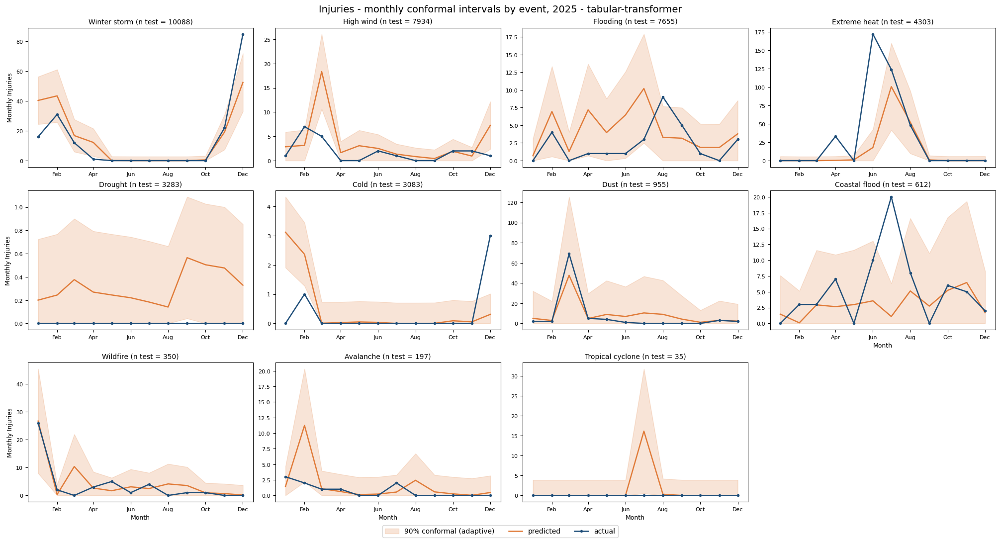

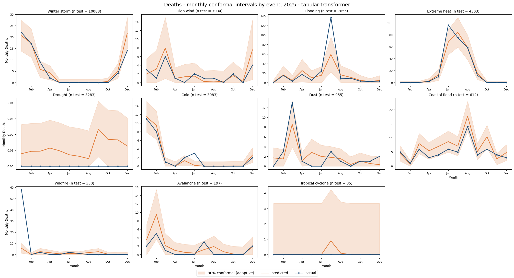

- The well-populated groups (`Winter_Storm`, `Extreme_Heat`, `Cold`, `Coastal_Flood`) are tracked closely, especially on deaths.
- **Single episodes escape the band:** June `Extreme_Heat` injuries (172 against a ceiling near 40), the January `Wildfire` deaths (58 against about 10) and the July `Flooding` deaths (137 against about 95).
- `Drought` and `Tropical_Cyclone` record zero casualties in 2025, so their wide flat bands cover the actuals trivially.

#### Transformer — backtest

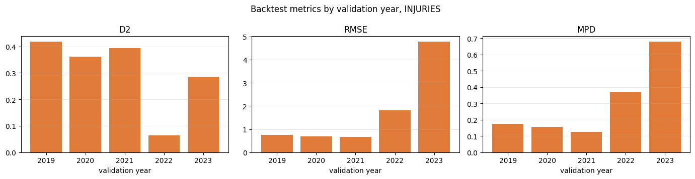

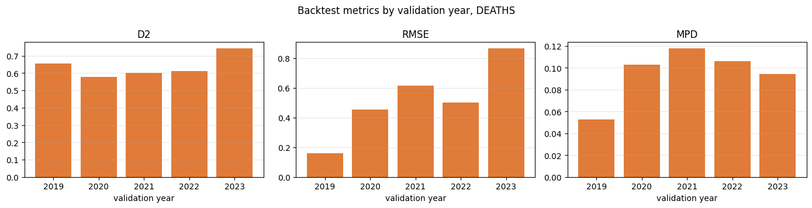

- **Injuries is unstable:** D2 is 0.36–0.42 and MPD 0.13–0.18 in 2019–2021. D2 then falls to 0.06 in 2022, a year that is weak for every model (the LSTM goes negative). MPD reaches 0.68 in 2023 because of one month, August 2023, with about 1,580 injuries; every model shows the same jump (0.63–0.78).
- **Deaths is steady:** D2 stays between 0.58 and 0.75 and MPD between 0.05 and 0.12 in all five years.

### Thunderstorm — 1955–2025


| Target | Metric | GLM | LightGBM | LSTM | TabPFN-3 | Transformer |
|---|---|---|---|---|---|---|
| `INJURIES` | backtest D2 | 0.20 | 0.39 | 0.39 | **0.44** | 0.39 |
| `INJURIES` | backtest MPD | 0.101 | 0.078 | 0.076 | **0.071** | 0.076 |
| `INJURIES` | 2025 D2 | 0.22 | 0.42 | 0.39 | **0.46** | 0.37 |
| `INJURIES` | 2025 MPD | 0.080 | 0.059 | 0.063 | **0.056** | 0.065 |
| `DEATHS` | backtest D2 | 0.25 | 0.45 | 0.43 | **0.48** | 0.43 |
| `DEATHS` | backtest MPD | 0.0202 | 0.0148 | 0.0154 | **0.0140** | 0.0152 |
| `DEATHS` | 2025 D2 | 0.21 | 0.44 | **0.45** | **0.45** | 0.44 |
| `DEATHS` | 2025 MPD | 0.0220 | 0.0157 | **0.0153** | 0.0154 | 0.0156 |

Backtest and test agree: TabPFN-3 is the most accurate on both D2 and MPD. It has the lowest backtest MPD in 3 of 5 years on injuries and 4 of 5 on deaths. The other nonlinear models are close behind, and the GLM is at about half their D2. Coverage is 0.91–0.92 everywhere. The trade-off is width: TabPFN-3 and the transformer have wider bands than LightGBM and the LSTM, and all bands are relatively wide because thunderstorm casualties are rare per event.

#### Transformer — conformal intervals 2025

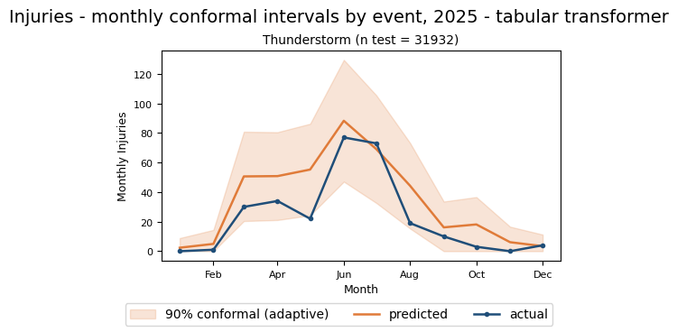

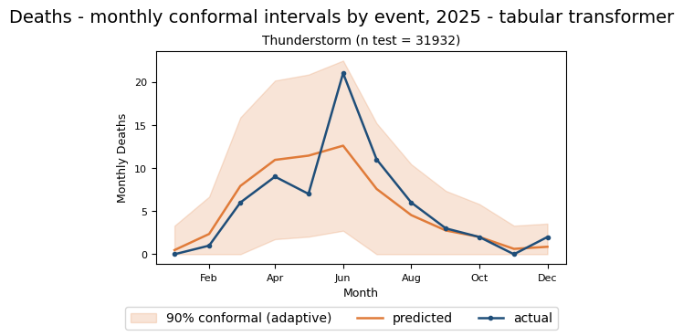

- The band follows the seasonal shape, peaking in June.
- **Injuries are over-called in spring:** about 50 injuries predicted per month in March–May against 22–34 recorded, and May falls just below the band.
- **Deaths stay inside all year.** The June peak (21) touches the ceiling while the prediction is too flat there.

#### Transformer — backtest

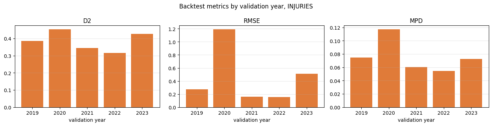

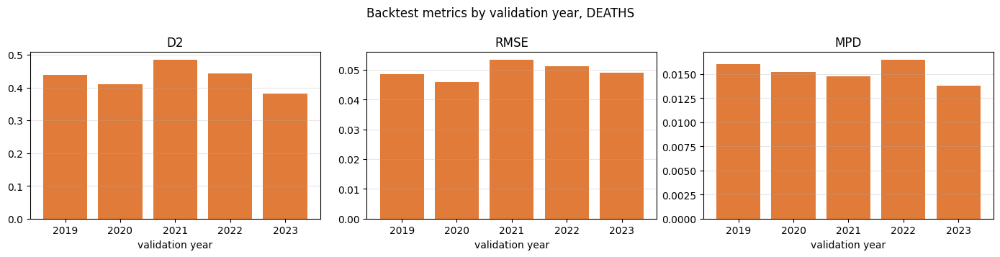

- **No negative year:** D2 is 0.32–0.45 on injuries and 0.38–0.48 on deaths. MPD stays between 0.055 and 0.117 on injuries and between 0.014 and 0.017 on deaths.
- **The 2020 injuries peak isn't the transformer's.** Every model has its highest MPD in 2020 (0.117–0.161), so it reflects that year's outbreaks.

### Tornado — 1950–2025


| Target | Metric | GLM | LightGBM | LSTM | TabPFN-3 | Transformer |
|---|---|---|---|---|---|---|
| `INJURIES` | backtest D2 | 0.32 | **0.63** | 0.57 | 0.62 | 0.59 |
| `INJURIES` | backtest MPD | 2.12 | **1.22** | 1.40 | 1.25 | 1.33 |
| `INJURIES` | 2025 D2 | −0.22 | −0.01 | 0.13 | **0.16** | −0.33 |
| `INJURIES` | 2025 MPD | 1.31 | 1.09 | 0.94 | **0.90** | 1.42 |
| `DEATHS` | backtest D2 | 0.27 | 0.60 | 0.56 | **0.62** | 0.61 |
| `DEATHS` | backtest MPD | 0.249 | 0.142 | 0.157 | **0.131** | 0.139 |
| `DEATHS` | 2025 D2 | 0.28 | **0.54** | 0.46 | 0.53 | 0.52 |
| `DEATHS` | 2025 MPD | 0.241 | **0.154** | 0.181 | 0.158 | 0.161 |

- **Injuries:** LightGBM and TabPFN-3 are level on the backtest (MPD 1.22 against 1.25), and every model collapses on 2025. TabPFN-3 is the only one that stays positive on D2 and has the lowest 2025 MPD (0.90 against 1.09 for LightGBM).
- **Deaths:** TabPFN-3 has the lowest backtest MPD, best in 3 of 5 years. On 2025, LightGBM, TabPFN-3 and the transformer are within 0.007 MPD, and the transformer has by far the tightest bands (RelWidth 1.07).
- Coverage is 0.92–0.93 for every model.

#### Transformer — conformal intervals 2025

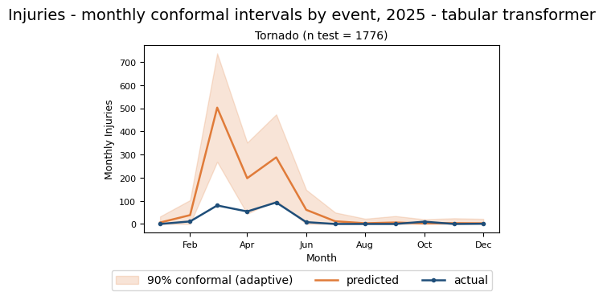

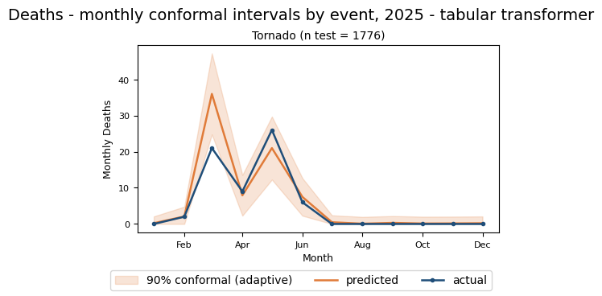

- **Something is wrong on injuries.** The transformer predicts about 500 injuries in March and 290 in May against 80 and 93 recorded, and both months fall below the band.
- **This matches how it was trained.** Early stopping kept the first epoch, the backtest folds are also trained for a single epoch, and the 2025 test D2 is −0.33. The tornado-injuries transformer should not be used as it stands.
- **Deaths are reasonable.** March is over-called (36 predicted, 21 recorded, just below the band) and May's 26 deaths stay inside. The rest of the year is near zero and well covered.

#### Transformer — backtest

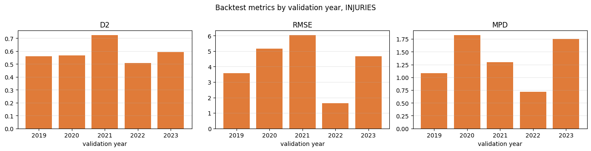

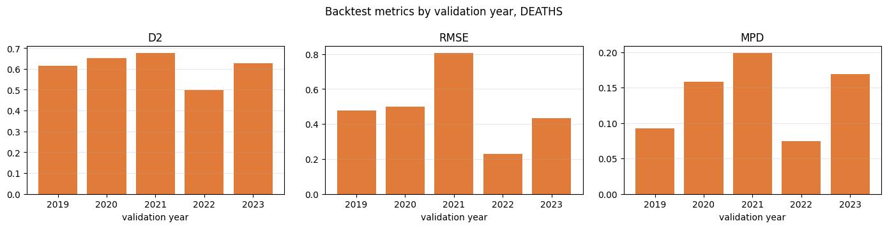

- **Injuries:** D2 is 0.51–0.72 across 2019–2023 and mean MPD 1.33, third behind LightGBM and TabPFN-3. This contrasts with the 2025 failure: a clean backtest does not rule out an under-trained model on a new year.
- **Deaths:** D2 is 0.50–0.68. 2022 has the weakest D2 for every model, with only 14 death-carrying events, yet the lowest MPD (0.075), simply because the year was quiet. This is why MPD compares models within a year, while D2 is the better read across years.

### Takeaways

- **No single model wins everywhere.** TabPFN-3 is the best choice on thunderstorm and tornado. On the global slice, LightGBM is best for injuries and the transformer for deaths.
- **The transformer is competitive, not dominant.** It is best on global deaths and has the tightest tornado deaths bands, but its tornado injuries model is under-trained and fails on 2025.
- **The GLM is the floor.** It is interpretable and stable, but it trails on every slice and goes negative where data is thinnest.
- **Intervals are calibrated everywhere** (coverage 0.91–0.93). What they cannot catch are single catastrophic episodes: heat waves, wildfires, flash floods and outbreak months.
- **D2 and MPD agree.** They pick the same leading model on every backtest and on every 2025 test. Where the backtest and 2025 disagree, the cause is the year, not the metric.
- **One test year can mislead.** Test, backtest and the monthly interval charts must be read together.

## Data files

The `data/` folder contains two datasets, each split into Parquet parts (zstd-compressed) to respect GitHub's file-size limits:

- **`StormEvents_part_1..5.parquet`** The raw merged dataset (output of step 2).
- **`StormEvents_fe_ep_augmentation_fin_update_part_1..15.parquet`** The final dataset with generated narratives, embedding features, and the LLM-derived columns (output of step 6).

To reassemble a dataset, concatenate its parts in order:

```python
import glob
import pandas as pd

parts = sorted(glob.glob("data/StormEvents_fe_ep_augmentation_fin_update_part_*.parquet"))
df = pd.concat([pd.read_parquet(p) for p in parts], ignore_index=True)
```
