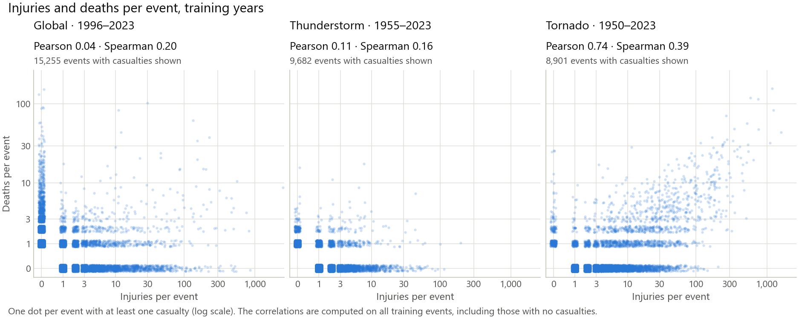
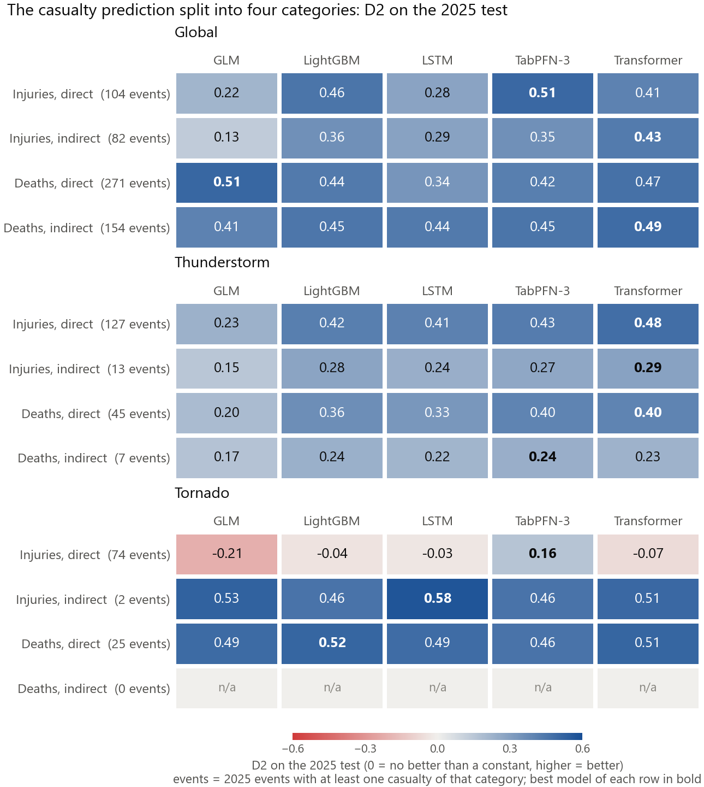
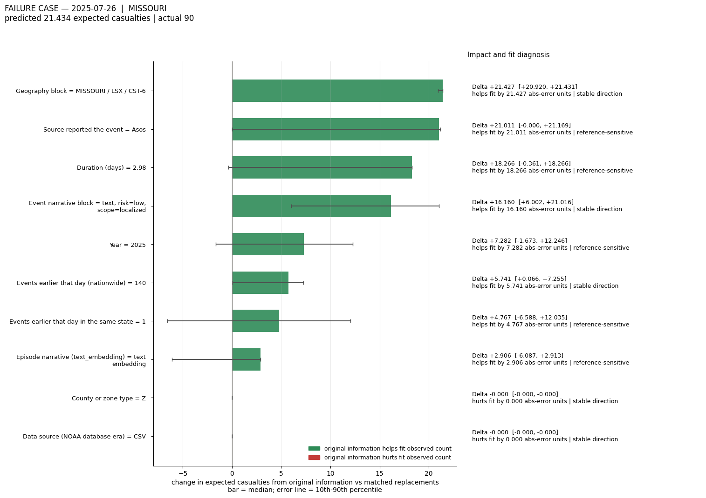
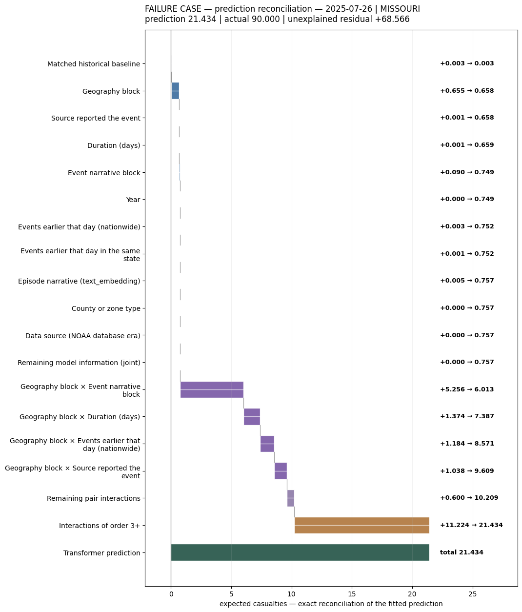
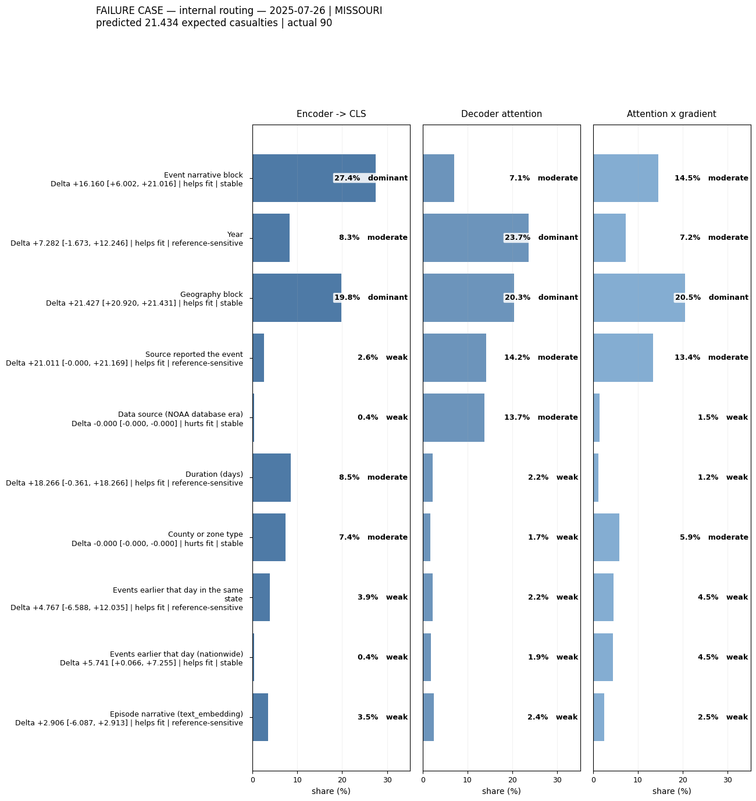
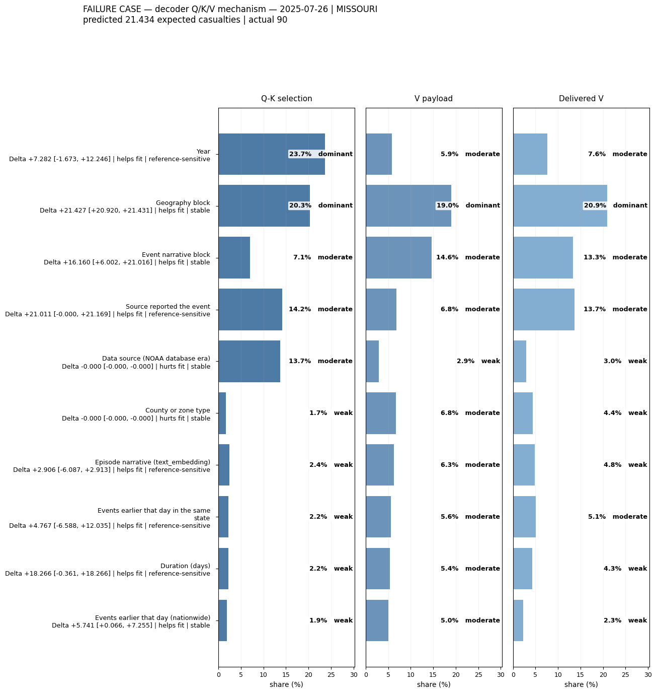
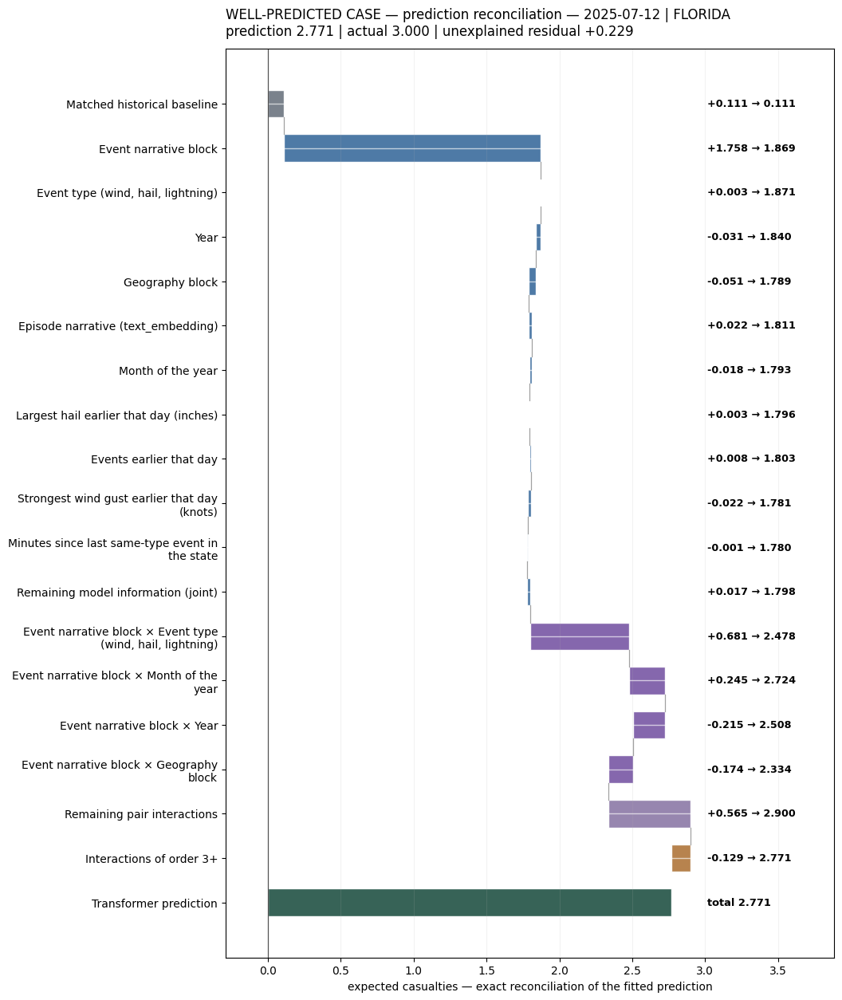
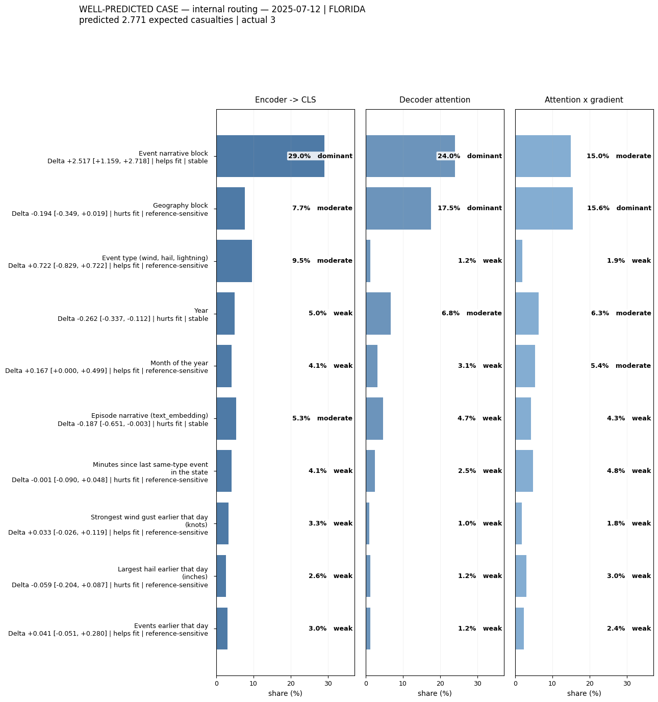

# Storm_Events

An end-to-end data pipeline for the [NOAA NCEI Storm Events Database](https://www.ncei.noaa.gov/access/storm-events-database), covering U.S. storm records from **1950 to 2025** (more than 2 million events). The pipeline merges and cleans the raw records, fills the missing narrative texts with LLM-generated ones, and enriches every event with embedding-based and LLM-derived features, producing a dataset ready for machine-learning work. 

## Data source

Storm event records are published by NOAA's National Centers for Environmental Information:

1. Open the [Storm Events Database FTP page](https://www.ncei.noaa.gov/pub/data/swdi/stormevents/csvfiles/).
2. Navigate to **HTTP access** and download the yearly CSV files (compressed in `.gz` format).

### What the source period of record actually means


This is NOAA's own description of the database, and it is the single most important thing to understand before modelling anything. The database spans 1950 to today, but **it is not one homogeneous series**, it is three different data-collection regimes stacked end to end:

- **1950–1954**: only **tornado** events were recorded.
- **1955–1995**: **tornado, thunderstorm wind and hail**.
- **1996–present**: all **48 event types** defined in [NWS Directive 10-1605](https://www.ncei.noaa.gov/access/storm-events-database/about) are recorded.

## Pipeline

The scripts and notebooks are numbered in the order they run.

1. **`1_extraction.py`** Extracts the individual CSV files from the downloaded `.gz` archives.
2. **`2_merge.py`** Merges the extracted CSV files, year by year, into a single raw dataset spanning 1950–2025.
3. **`3_StormEvents_Cleaning_used.ipynb`** Assesses the missing values (which columns have gaps and how the missingness is distributed over time), then cleans the raw dataset: parses the damage strings, normalises the tornado intensity scale, groups the 56 raw event types into broader **event groups**, fills missing values, and drops columns that are unpopulated or redundant. Its output is the cleaned dataset used in all subsequent steps.
4. **`4_StormEvents_filling_text_generation_used.py`** Identifies every event missing an `EPISODE_NARRATIVE` or `EVENT_NARRATIVE` and generates the missing text with OpenAI's **`gpt-4o-mini`** through the **Batch API**. Rows that already have both narratives are never sent, and when one narrative exists it is passed to the model as context so the generated text stays consistent with it. The structured fields of the row (event type, state, dates, magnitude, damages, casualties…) are supplied as grounding context so the generated narrative is factual rather than invented.
5. **`5_StormEvents_embedding_augmentation_used.py`** Encodes the episode and event narratives with the **`all-MiniLM-L12-v2`** sentence-transformer model and applies dimensionality reduction, turning the free text into a compact set of numeric embedding features usable alongside the tabular columns. Embeddings could also be produced through the OpenAI API, GPT-family models, but `gpt-4o-mini` itself is used as a generative endpoint that returns text, not vectors. A local sentence-transformer was preferred here because it is purpose-built for sentence-level embeddings, producing a fixed-length numeric vector that captures each narrative's meaning, exactly the form needed for machine-learning features. 

   One could object that OpenAI's embedding models return richer vectors (1,536 dimensions or more, against MiniLM's 384) and should therefore capture more nuance. In this pipeline that advantage would be lost: the embeddings are not used raw but compressed by TruncatedSVD down to **10 components per narrative** (`ep_embedding_1..10`, `ev_embedding_1..10`), so both models funnel into the same small feature set and the extra dimensions would mostly be discarded. Vector size is also not a quality measure in itself. `all-MiniLM-L12-v2` scores strongly on sentence-similarity benchmarks despite its compact size, and the storm narratives are short weather descriptions that a compact model represents well. For this use case the larger vectors would add API cost and processing time without a measurable gain in the final 10 features.
6. **`6_StormEvents_feature_augmentation_used.py`** Asks `gpt-4o-mini`, again through the Batch API, to read each `EPISODE_NARRATIVE` and answer two questions, adding one categorical column per answer:

   | New column | Question the LLM answers | Possible answers |
   |---|---|---|
   | `risk` | How dangerous was the episode? | high / medium / low |
   | `event_scope` | How large an area was affected? | localized / county-wide / regional / widespread |

   Each label is defined explicitly in the system prompt (e.g. `high` = deaths, injuries or major destruction occurred or were clearly likely) so the classification stays consistent across the whole dataset, and the model is instructed to judge only what the text states rather than assume unmentioned impacts.
7. **`7_export_github.py`** Splits the datasets into compressed Parquet parts small enough for GitHub and writes them to the `data/` folder.
8. **`8_EDA_used.ipynb`** Exploratory analysis of the final dataset: coverage over time, event-group composition, geography, damage and casualty trends, stationarity and seasonality of the monthly series, and the categorical drivers of impact. Some pictures below come from this notebook.
9. **`9_Global_estimation_count_v3.ipynb`**, **`9_Thunderstorm_estimation_count_v3.ipynb`**, **`9_Tornado_estimation_count_v3.ipynb`** Three parallel modelling notebooks that share one design and differ only in the slice of the database they cover. The split follows the collection-regime problem described above: Tornado and Thunderstorm have event records long before 1996, so they are modelled separately, while the remaining event groups are modelled together from 1996 onward.

   | Notebook | Scope | Period | Events 
   |---|---|---|---|
   | `9_Global_…` | the 11 event groups left after removing Tornado, Thunderstorm and the four almost-empty groups (`Geomagnetic`, `Volcanic`, `Tsunami`, `Marine_Other`) | 1996–2025 | 888,673 
   | `9_Thunderstorm_…` | `Thunderstorm` | 1955–2025 | 1,032,841 
   | `9_Tornado_…` | `Tornado` | 1950–2025 | 90,255 

   All three read the augmented dataset straight from the parquet files in `data/` and follow the same protocol. The target is a single count, **`CASUALTY`** (injuries plus deaths, direct and indirect). The data is **split by date first** (train through 2023, calibration 2024, test 2025) and only then filtered for zero-variance, redundant and high-cardinality features **using training rows alone**, so no test information reaches the design matrix. Each event also gets a set of **same-day context features** (how many events had already started that day nationwide, in the same group and in the same state, how many of them were high-risk or wide in scope, and the hours since the previous event of the same group in the same state), built from the predictors of earlier events only, never from their casualties, and one split at a time. Four models are fitted: a Poisson **GLM**, **LightGBM**, an **LSTM** and **TabPFN-3**. The GLM, LightGBM and LSTM hyperparameters are selected with expanding-window cross-validation over validation years, minimizing mean Poisson deviance; TabPFN-3 uses a fixed in-context configuration with a target-stratified context of up to 50,000 training rows. Every model is backtested on the same expanding-window folds and produces 90% adaptive conformal intervals. A last section measures how injuries and deaths move together, then splits the casualty prediction into injuries and deaths, direct and indirect, with fixed shares estimated on the training years, without fitting a second model.
10. **`10_Global_Tabular_Transformer_estimation_end_to_end_v0.ipynb`**, **`10_Thunderstorm_Tabular_Transformer_estimation_end_to_end_v0.ipynb`**, **`10_Tornado_Tabular_Transformer_estimation_end_to_end_v1.ipynb`** A fifth model for each slice: a **tabular transformer** written directly in PyTorch, where every feature of an event (each categorical column, each numeric column, the two narrative embeddings, the season and the year) becomes one token. It uses the same data, date split, target, context features, metrics, conformal intervals and backtest folds as the matching `9_…` notebook, so its results can be read side by side with the other four models. It is trained in two passes: the first holds out 2023 to choose the number of epochs, the second refits on all the training years, as the other models do. The notebook closes with an **interpretability** section that goes from single events (what changes the prediction when one piece of information is replaced with a plausible historical alternative, and how that information travels through the attention layers) to a check over a whole year (how much the error grows when one piece of information is shuffled). The process and its results are in the [Transformer interpretability](#transformer-interpretability) section.
11. **`11_Global_Estimation_Comparison_v3.ipynb`**, **`11_Thunderstorm_Estimation_Comparison_v3.ipynb`**, **`11_Tornado_Estimation_Comparison_v3.ipynb`** Load the saved results of the five models for one slice and compare them: point metrics by split plus the mean over the backtest years, conformal coverage and relative width, and the scores of the injuries / deaths split. The comparison pictures below come from these notebooks.

## What the data looks like

### Events per year


The yearly event count is flat and low (a few thousand per year) through the 1950s–1980s, then rises through the early 1990s and **jumps almost fourfold between 1995 and 1996**, from roughly 9,000 to nearly 50,000 events. That vertical wall is not a climate signal: it is the 1996 switch to recording all 48 event types described above. After 1996 the series settles into a genuine range of roughly 50,000–80,000 events per year, with the peaks (2008, 2011, 2023–2025) reflecting real, severe storm seasons.

### Composition by event group


The 56 raw NOAA event types are collapsed into 17 broader **event groups**. The chart shows how many rows each group holds and the first/last year it appears, and it makes two things immediately clear.

First, the distribution is extremely **imbalanced**. `Thunderstorm` alone accounts for about 1.03 million rows, more than half the dataset. At the other end, `Geomagnetic` has 8 rows, `Tsunami` 52 and `Volcanic` 147. 

Second, the **start years confirm the collection-regime story**: `Tornado` starts in 1950 and `Thunderstorm` in 1955, while nearly every other group starts in exactly 1996. A few start even later simply because the phenomenon is rare or was catalogued later (`Marine_Other` 2002, `Tsunami` 2006).

### Geographic distribution


A 60,000-point sample of event coordinates over the continental U.S. The density map matches known U.S. severe-weather climatology: a dense core across the Great Plains and the Midwest into the Southeast (Tornado Alley and Dixie Alley), heavy coverage along the Gulf and Atlantic coasts and the Florida peninsula, and a comparatively sparse, clustered West where events concentrate around populated valleys and mountain corridors.

Part of that east/west contrast is meteorological and part is **reporting bias**: storm events are recorded when someone observes and reports them, so sparsely populated areas generate fewer records for the same weather. 

## Casualty-Count Modeling results

The unit of analysis is the **single storm event**: one row, one event. The target is **`CASUALTY`**, the total number of people injured or killed by the event (direct and indirect). Every model returns the **expected number of casualties for that event**, conditional on its characteristics and on what had already happened earlier the same day, with a Poisson objective (TabPFN-3 works on a transformed casualty rate and returns predictions on the count scale).

Models are ranked on **D2** (Poisson pseudo-R², high = better) and **mean Poisson deviance** (MPD, low = better), the two metrics consistent with the Poisson objective. RMSE appears in the comparison charts but is not used: squared errors are dominated by a handful of catastrophic events. MPD is on the scale of each slice, so it compares models within one slice, not across them. For the intervals, event-level predictions are summed by day and the 90% adaptive conformal interval is checked against the daily casualty total of 2025: **coverage** should sit near 0.90, and **RelWidth** (mean band width over mean daily actual) says how tight the band is.

**How the best model is chosen.** The 2025 test split is a single year. The **backtest** refits every model on five expanding-window folds (train ≤ 2018 → predict 2019, …, train ≤ 2022 → predict 2023), so its mean D2 and mean MPD are the main criterion; the 2025 test and the interval width break ties. The backtest means are the last column of each comparison chart.

| Slice | Best model | Backtest D2 | Backtest MPD | 2025 test D2 | 2025 test MPD | Coverage | RelWidth |
|---|---|---|---|---|---|---|---|
| Global | **TabPFN-3** | 0.45 | 0.341 | 0.58 | 0.184 | 0.92 | 2.06 |
| Thunderstorm | **Transformer** | 0.46 | 0.0775 | 0.50 | 0.0608 | 0.92 | 2.46 |
| Tornado | **TabPFN-3** | 0.65 | 1.26 | 0.32 | 0.89 | 0.93 | 2.20 |

The 2025 interval charts below are the best model's for each slice: monthly totals of the event-level predictions with the 90% adaptive conformal band, one panel per event group.

### Global — 11 event groups, 1996–2025


| Metric | GLM | LightGBM | LSTM | TabPFN-3 | Transformer |
|---|---|---|---|---|---|
| backtest D2 | 0.316 | 0.428 | 0.389 | 0.447 | **0.452** |
| backtest MPD | 0.431 | 0.364 | 0.386 | **0.341** | 0.351 |
| 2025 D2 | 0.41 | 0.56 | 0.42 | **0.58** | 0.57 |
| 2025 MPD | 0.255 | 0.192 | 0.250 | **0.184** | 0.187 |
| Coverage | 0.92 | 0.91 | 0.92 | 0.92 | 0.92 |
| RelWidth | 2.42 | **1.65** | 1.86 | 2.06 | 1.75 |

- **TabPFN-3 is the best model, by a narrow margin:** it has the lowest backtest MPD (0.341) and leads on both 2025 metrics.
- **The transformer is level with it:** it has the highest backtest D2 (0.452 against 0.447), the second-lowest backtest MPD (0.351) and a 2025 score just behind (MPD 0.187 against 0.184). Year by year, the lowest backtest MPD goes to the transformer in 2019 and 2020, to TabPFN-3 in 2021 and 2023, and to LightGBM in 2022.
- **2023 is hard for every model:** MPD is 0.60–0.86, against 0.18–0.28 in 2019–2021.
- **Intervals:** coverage is 0.91–0.92 for every model. TabPFN-3 pays for its accuracy with a wider band than LightGBM and the transformer (RelWidth 2.06 against 1.65 and 1.75).

#### TabPFN-3 — conformal intervals by event group, 2025


- **Tracked closely:** `Extreme_Heat` follows the summer peak, `Coastal_Flood`, `Avalanche` and `Dust` stay inside the band almost all year, and the March `Dust` spike (82) is still covered.
- **Single episodes escape the band:** the January `Wildfire` (84 casualties against a ceiling near 30), the July `Flooding` (140 against about 85) and the June `Extreme_Heat` peak (268 against about 175).
- **Over-called in winter:** `Winter_Storm` in January (150 predicted, 38 recorded), `Cold` in January–February and `High_Wind` in December fall below the band.
- `Drought` and `Tropical_Cyclone` record zero casualties in 2025. The model still expects a few, so the bands are wide, and in autumn `Drought` falls just below them.

### Thunderstorm — 1955–2025


| Metric | GLM | LightGBM | LSTM | TabPFN-3 | Transformer |
|---|---|---|---|---|---|
| backtest D2 | 0.24 | 0.43 | 0.43 | 0.44 | **0.46** |
| backtest MPD | 0.1092 | 0.0809 | 0.0814 | 0.0806 | **0.0775** |
| 2025 D2 | 0.25 | 0.45 | 0.43 | 0.46 | **0.50** |
| 2025 MPD | 0.0909 | 0.0674 | 0.0698 | 0.0656 | **0.0608** |
| Coverage | 0.91 | 0.92 | 0.91 | 0.92 | 0.92 |
| RelWidth | 3.90 | 2.53 | **2.46** | 3.06 | **2.46** |

- **The transformer is the best model:** it leads on every metric, has the lowest backtest MPD in 3 of 5 years (2021–2023), and ties the LSTM for the tightest band.
- LightGBM, the LSTM and TabPFN-3 are level behind it (backtest MPD 0.0806–0.0814). The GLM is at about half their D2.
- **2020 is the hardest year for every model** (MPD 0.10–0.16), reflecting that year's outbreaks.

#### Transformer — conformal intervals, 2025


- The prediction follows the seasonal shape, rising from March and peaking in June.
- **Every month is inside the band.** The June–July peak (98 and 84 recorded) is slightly under-called (82 and 64 predicted) and May is over-called (45 against 29), but all stay covered.

### Tornado — 1950–2025


| Metric | GLM | LightGBM | LSTM | TabPFN-3 | Transformer |
|---|---|---|---|---|---|
| backtest D2 | 0.50 | 0.64 | 0.58 | **0.65** | 0.60 |
| backtest MPD | 1.77 | 1.26 | 1.45 | **1.26** | 1.34 |
| 2025 D2 | 0.03 | 0.17 | 0.18 | **0.32** | 0.15 |
| 2025 MPD | 1.27 | 1.08 | 1.07 | **0.89** | 1.11 |
| Coverage | 0.92 | 0.93 | 0.93 | 0.93 | 0.93 |
| RelWidth | 3.86 | 2.73 | 2.35 | **2.20** | 2.48 |

- **TabPFN-3 is the best model:** it is level with LightGBM on the backtest (MPD 1.259 against 1.261, D2 0.65 against 0.64) and clearly ahead on 2025 (D2 0.32 against 0.15–0.18 for the other nonlinear models), with the tightest band.
- **2025 is a hard year for every model:** D2 drops from 0.58–0.65 on the backtest to 0.15–0.32, and the GLM is close to zero (0.03).
- Coverage is 0.92–0.93 for every model.

#### TabPFN-3 — conformal intervals, 2025


- **The spring outbreak season is over-called:** 252 casualties predicted in March against 101 recorded, and 104 in April against 63. March sits on the lower edge of the band.
- **May is on target** (115 predicted, 118 recorded), and the quiet months from June to December are near zero and well covered.
- The band is widest in March (up to about 390): that is when a single outbreak can move the monthly total by hundreds of casualties.

### From casualties to injuries and deaths

Each model predicts one number per event, `CASUALTY`. NOAA records it in **four categories**: injuries and deaths, each either **direct** (caused by the event itself) or **indirect** (caused by something the event set off). The `9_…` and `10_…` notebooks check whether the single prediction can be split into those categories **without a second model**. Two questions come first: do injuries and deaths move together, and how much does each category weigh?

#### How injuries and deaths move together



Two correlations are reported because they answer different questions. **Pearson** measures agreement of the values and is driven by the few very large events. **Spearman** measures agreement of the rankings and gives small and large events the same weight.

| Slice | Years | Events | Pearson | Spearman | Pearson without large events | Events with injuries that also have deaths | Events without injuries that have deaths |
|---|---|---|---|---|---|---|---|
| Global | training, 1996–2023 | 812,807 | 0.04 | 0.20 | 0.07 | 24% | 1.00% |
| Global | test, 2025 | 38,495 | 0.05 | 0.23 | 0.08 | 34% | 0.88% |
| Thunderstorm | training, 1955–2023 | 970,919 | 0.11 | 0.16 | 0.11 | 8% | 0.14% |
| Thunderstorm | test, 2025 | 31,932 | 0.17 | 0.19 | 0.17 | 12% | 0.11% |
| Tornado | training, 1950–2023 | 86,063 | 0.74 | 0.39 | 0.48 | 18% | 0.35% |
| Tornado | test, 2025 | 1,776 | 0.30 | 0.36 | 0.30 | 21% | 0.53% |

"Large events" are those with more than 100 casualties. The next table shows, over the training years, how often an event that injured someone also killed someone, by number of people injured (number of events in brackets).

| People injured | Global | Thunderstorm | Tornado |
|---|---|---|---|
| 1–5 | 23% (5,799) | 8% (7,733) | 8% (6,045) |
| 6–20 | 23% (987) | 14% (501) | 29% (1,715) |
| 21–100 | 30% (349) | 18% (66) | 64% (721) |
| more than 100 | 57% (69) | 50% (2) | 95% (146) |

- **Tornado: injuries and deaths rise together.** Pearson is 0.74, and the share of events with at least one death climbs from 8% to 95% as the number injured grows. Much of that link comes from the big outbreaks: without the events above 100 casualties Pearson falls to 0.48, and in 2025, a year with no such event, it is 0.30.
- **Global: almost no link** (Pearson 0.04, Spearman 0.20). The chart shows why: the events form two separate arms, one with injuries and few deaths, one with deaths and no injuries. Over the training years 82% of the events with deaths recorded no injuries at all (67% on thunderstorm, 15% on tornado).
- **Thunderstorm: a weak link** (0.11 and 0.16). Deaths are rare: only 8% of the events that injure someone also kill someone.

#### How much each category weighs

Share of all casualties held by each category, over the training years and in the 2025 test year.

| Category | Global, training | Global, 2025 | Thunderstorm, training | Thunderstorm, 2025 | Tornado, training | Tornado, 2025 |
|---|---|---|---|---|---|---|
| Injuries, direct | 58.1% | 34.8% | 84.0% | 68.0% | 93.8% | 77.3% |
| Injuries, indirect | 18.3% | 16.6% | 5.1% | 12.0% | 0.3% | 2.8% |
| Deaths, direct | 18.8% | 32.3% | 9.6% | 17.6% | 5.9% | 19.9% |
| Deaths, indirect | 4.8% | 16.2% | 1.2% | 2.3% | 0.04% | 0% |
| **All deaths** | **23.6%** | **48.6%** | **10.8%** | **19.9%** | **6.0%** | **19.9%** |

The split is a fixed proportion: each predicted casualty count is multiplied by the **training** share of the category, and the product is scored against the recorded value. In 2025 deaths weigh about twice their training share on the global and thunderstorm slices and three times on tornado, and this is what the test results below pay for.

#### 2025 test results by category



D2 can be compared across categories. MPD cannot, because it is on the scale of each category, so it compares models within one row only. The "2025 events" column counts the test events with at least one casualty of that category, with the number of people in brackets.

**Global**

| Category | 2025 events | Metric | GLM | LightGBM | LSTM | TabPFN-3 | Transformer |
|---|---|---|---|---|---|---|---|
| Injuries, direct | 104 (542) | D2 | 0.22 | 0.46 | 0.28 | **0.51** | 0.41 |
| | | MPD | 0.1652 | 0.1145 | 0.1513 | **0.1041** | 0.1249 |
| Injuries, indirect | 82 (259) | D2 | 0.13 | 0.36 | 0.29 | 0.35 | **0.43** |
| | | MPD | 0.0791 | 0.0588 | 0.0648 | 0.0591 | **0.0517** |
| Deaths, direct | 271 (504) | D2 | **0.51** | 0.44 | 0.34 | 0.42 | 0.47 |
| | | MPD | **0.0741** | 0.0850 | 0.1003 | 0.0879 | 0.0799 |
| Deaths, indirect | 154 (253) | D2 | 0.41 | 0.45 | 0.44 | 0.45 | **0.49** |
| | | MPD | 0.0448 | 0.0414 | 0.0423 | 0.0412 | **0.0384** |

- **No model wins all four categories:** TabPFN-3 is best on direct injuries, the transformer on both indirect categories, and the GLM on direct deaths.
- **The level is off, in opposite directions:** every model predicts too few deaths (44–62% of the recorded direct deaths, 22–31% of the indirect ones) and too many direct injuries (127–178% of the recorded ones). This comes mostly from the fixed share rather than from the models: deaths were 24% of casualties in training and 49% in 2025.

**Thunderstorm**

| Category | 2025 events | Metric | GLM | LightGBM | LSTM | TabPFN-3 | Transformer |
|---|---|---|---|---|---|---|---|
| Injuries, direct | 127 (232) | D2 | 0.23 | 0.42 | 0.41 | 0.43 | **0.48** |
| | | MPD | 0.0665 | 0.0504 | 0.0511 | 0.0494 | **0.0450** |
| Injuries, indirect | 13 (41) | D2 | 0.15 | 0.28 | 0.24 | 0.27 | **0.29** |
| | | MPD | 0.0192 | 0.0163 | 0.0172 | 0.0165 | **0.0161** |
| Deaths, direct | 45 (60) | D2 | 0.20 | 0.36 | 0.33 | 0.40 | **0.40** |
| | | MPD | 0.0204 | 0.0162 | 0.0170 | **0.0152** | **0.0152** |
| Deaths, indirect | 7 (8) | D2 | 0.17 | 0.24 | 0.22 | **0.24** | 0.23 |
| | | MPD | 0.0035 | **0.0032** | 0.0033 | **0.0032** | 0.0033 |

- **The transformer keeps its lead:** it is best on both injury categories and level with TabPFN-3 on direct deaths, the same order as on the casualty target.
- **The indirect categories are thin:** 13 events with indirect injuries and 7 with indirect deaths in the whole year, and D2 stays at 0.15–0.29.
- **Deaths are under-called here too:** the models predict 46–84% of the recorded direct deaths.

**Tornado**

| Category | 2025 events | Metric | GLM | LightGBM | LSTM | TabPFN-3 | Transformer |
|---|---|---|---|---|---|---|---|
| Injuries, direct | 74 (248) | D2 | -0.21 | -0.04 | -0.03 | **0.16** | -0.07 |
| | | MPD | 1.2679 | 1.0870 | 1.0781 | **0.8783** | 1.1162 |
| Injuries, indirect | 2 (9) | D2 | 0.53 | 0.46 | **0.58** | 0.46 | 0.51 |
| | | MPD | 0.0342 | 0.0389 | **0.0307** | 0.0391 | 0.0357 |
| Deaths, direct | 25 (64) | D2 | 0.49 | **0.52** | 0.49 | 0.46 | 0.51 |
| | | MPD | 0.1706 | **0.1633** | 0.1718 | 0.1814 | 0.1643 |
| Deaths, indirect | 0 (0) | D2 | n/a | n/a | n/a | n/a | n/a |
| | | MPD | n/a | n/a | n/a | n/a | n/a |

- **Direct injuries carry the 2025 miss:** they are 77% of the year's casualties, and every model predicts between 2.1 and 3.5 times the recorded number, the same spring over-call seen in the interval chart. D2 is negative for every model except TabPFN-3 (0.16).
- **Direct deaths are scored well by every model** (D2 0.46–0.52), although the level is low (51–87% of the recorded deaths).
- **The indirect categories cannot be judged:** 2025 has two tornadoes with indirect injuries and none with indirect deaths.

### Takeaways

- **No single model wins everywhere.** TabPFN-3 is the best choice on the global and tornado slices, the transformer on thunderstorm.
- **The transformer is competitive on every slice.** It is best on thunderstorm and level with TabPFN-3 on global.
- **The GLM is the floor.** It is interpretable and stable, but it trails on every slice and falls to D2 0.03 on tornado 2025.
- **Intervals are calibrated everywhere** (coverage 0.91–0.93). What they cannot catch are single catastrophic episodes: heat waves, wildfires, flash floods and outbreak months.
- **One test year can mislead.** Tornado 2025 is much harder than the backtest years for every model, so test, backtest and the monthly interval charts must be read together.
- **Injuries and deaths are closely linked only for tornadoes.** On the global slice most deaths come from events with no injuries, so the two do not move together.
- **A fixed split ranks events well but misses the level when the mix changes.** In 2025 deaths weigh two to three times their training share, so every model under-calls deaths and over-calls direct injuries.
- **The narratives matter.** On the global and thunderstorm slices the event narrative and the features read from it are what the transformer depends on most (see the next section).

## Transformer interpretability

The `10_…` notebooks end with a section that opens the transformer and explains its predictions: which information moves a prediction, how the prediction is put together, and how that information travels inside the network. Everything is computed with the **same fitted model**. No simplified stand-in model is trained to explain it.

One rule holds throughout: **prediction impact comes first.** Attention shows where the model looks, not what changes the result, so it is read as a description of the mechanism and never as a ranking of feature importance. The results below show why.

### How the transformer reads an event

Three things are needed to follow the charts.

- **Tokens.** Each piece of information about an event (the state, the reporting source, the duration, each narrative embedding, the month, the year…) becomes one token. An extra **summary token**, called CLS in the transformer literature, is added in front. An event is 19 tokens on the global group, 23 on thunderstorm and 22 on tornado.
- **Encoder.** The tokens exchange information with each other through attention layers, so each one ends up carrying context from the others.
- **Decoder and output.** The summary token then reads the encoded tokens once more, again through attention, and a final layer turns it into the expected number of casualties.

Attention works through three quantities, usually shortened to **Q/K/V**: the **query** (what the summary token is looking for), the **key** (what each token offers to be matched on) and the **value** (the content a token passes on if it is selected).

### The process


The process goes from single events to a whole year, and from "what changes the prediction" to "how the network does it".

| Stage | Question | How it is answered | How to read the chart |
|---|---|---|---|
| 1. Case selection | Which events are worth explaining? | Among the 2025 test events in the top quarter of non-zero casualty counts, the three with the largest absolute error (**failure** cases) and the three with the smallest (**well-predicted** cases). | A table with the recorded and the predicted casualties. |
| 2. Local impact | What happens to the prediction if one piece of information were different? | That piece is replaced with the values of 32 similar historical events, and the model predicts again each time. | Bar = median change in expected casualties, line = 10th to 90th percentile. A bar to the right means the original information raises the prediction. Green means it brings the prediction closer to the recorded count, red means it takes it further away. "Stable direction" means the whole 10th to 90th percentile range is on one side of zero; otherwise the effect is "reference-sensitive", that is, it depends on which historical event is used as replacement. |
| 3. Reconciliation | How does the model get from a typical similar event to this exact prediction? | The prediction for 16 similar historical events is the starting point. The event's own information is then added in every possible combination, which separates the effect of each piece alone, of each pair, and of three or more together. | A waterfall that adds up exactly to the prediction. The gap between prediction and recorded count is model error and is reported apart. |
| 4. Internal routing | Where does that information travel inside the network? | Three shares per piece of information: how much of it reaches the summary token through the encoder, how much attention the decoder gives it, and the same attention weighted by how sensitive the prediction is to it (attention × gradient). | Shares in percent: **dominant** from 15%, **moderate** from 5% to 15%, **weak** below 5%. A share is not a contribution to the casualty count. |
| 5. Q/K/V | Why does the decoder pick and pass on that information? | Three shares again: what the summary token selects (Q–K selection), how much content each token has to offer (V payload), and what is actually delivered once the two are combined (delivered V). | Same bands as stage 4. |
| 6. Global check | Does the model depend on the same information over a whole year? | One piece of information at a time is shuffled across all the events of 2024 and of 2025, five times, and the error is measured again. | Bar = increase in MPD. A long bar means the model depends on that information. A bar to the left of zero means the model was better off without it that year. |

Three choices apply to every stage:

- **Information that belongs together moves together.** State, forecast office and time zone form one **geography block** (state and forecast office on thunderstorm). The event narrative embedding and the `risk` and `event_scope` labels read from the narratives form one **event narrative block**. Changing only one of them would create an event that cannot exist, such as a Texas county served by a Florida forecast office.
- **Replacements are real and similar.** They come from training-year events matched on the other characteristics of the event, such as place, reporting source, duration, same-day context, season and year. The casualties are never used for the matching.
- **The explanation is checked against the model.** The passes that extract attention and Q/K/V reproduce the model's own predictions (largest difference 0.000002 on the log scale).

Stages 2 to 5 follow the same ten pieces of information for each event, the ones with the largest local impact. For each group one event is followed below through all the stages. The other five are summarised in the text and shown in full in the notebook.

### Results: Global

| Case | Date | State | Event | Recorded | Predicted |
|---|---|---|---|---|---|
| Failure | 23 Jun 2025 | New Jersey | Excessive heat | 166 | 0.06 |
| Failure | 26 Jul 2025 | Missouri | Excessive heat | 90 | 21.4 |
| Failure | 4 Jul 2025 | Texas | Flash flood | 61 | 0.77 |
| Well-predicted | 19 Aug 2025 | Arizona | Heat | 2 | 2.01 |
| Well-predicted | 19 Oct 2025 | Oregon | Sneaker wave | 2 | 1.95 |
| Well-predicted | 21 Mar 2025 | Lake Michigan | Marine strong wind | 2 | 2.07 |

For scale, the average 2025 event on this group has 0.04 casualties. The event followed is the Missouri heat wave: several days of extreme heat in the St. Louis area, 90 people recorded, 21.4 predicted.



- **Four pieces of information each carry almost the whole prediction.** Replacing the geography block (Missouri, the St. Louis forecast office) lowers the prediction by 21.4, the reporting source (an airport weather station) by 21.0, the duration of almost three days by 18.3, and the event narrative block by 16.2. Each of them removes most of the 21.4, so they cannot be simply added: the prediction exists only when they occur together.
- **All of them help.** Every visible bar is green: the model under-calls this event, and each piece of information pushes in the right direction.



- **The prediction is made of combinations.** Similar historical events are predicted at almost zero (0.003). The single pieces of information add less than 1 casualty in total. Pairs add 9.5, and the four largest pairs all include the geography block. Combinations of three or more add another 11.2. The model has learned that this place, with this kind of narrative, source and duration, goes with many casualties.





- **The geography block is dominant at every step:** about 20% of what reaches the summary token, of the decoder's attention and of the delivered content.
- **Attention and impact do not match.** The year receives the largest share of the decoder's attention (23.7%) but has little content to pass on, and delivers 7.6%. The data-source token receives 13.7% of the attention and has no effect at all on the prediction. The duration, worth 18.3 casualties in stage 2, receives 2.2%: it reaches the summary token mainly through the encoder (8.5%).

The other cases:

- **New Jersey heat (166 recorded, 0.06 predicted).** No replacement moves the prediction by more than about 1.3 casualties. The model has nothing to work with: the record is labelled `risk` = low and `event_scope` = localized, and the reconciliation starts and ends near zero.
- **Texas flash flood (61 recorded, 0.77 predicted).** Every piece of information raises the prediction, the six largest with a stable direction, led by the narrative block (`risk` = high, `event_scope` = county-wide, +0.75). The model does recognise a dangerous event, about twenty times the average one, but not a catastrophe of this size.
- **Well-predicted cases.** They are small events (2 casualties) and the narrative block is the largest driver in all three: +0.89 on the Arizona heat event, +1.86 on the Oregon sneaker wave, +2.04 on the Lake Michigan wind event. On the Arizona event it is also dominant at every routing step (24%, 44% and 33%).


- **Over the whole year the event narrative block comes first.** Shuffling it raises the MPD by about 0.35 in 2024 and 0.24 in 2025, against 0.245 and 0.187 with all the information in place, so the error more than doubles.
- **The reporting source, the geography block and the event group follow at a distance.** The same-day context features, the year and the data source add almost nothing.

### Results: Thunderstorm

| Case | Date | State | Event | Recorded | Predicted |
|---|---|---|---|---|---|
| Failure | 22 Jul 2025 | South Carolina | Heavy rain | 28 | 0.32 |
| Failure | 24 Jun 2025 | South Carolina | Lightning | 20 | 2.10 |
| Failure | 1 Jun 2025 | Texas | Lightning | 14 | 0.29 |
| Well-predicted | 22 Jun 2025 | Pennsylvania | Lightning | 2 | 2.22 |
| Well-predicted | 12 Jul 2025 | Florida | Lightning | 3 | 2.77 |
| Well-predicted | 8 Jun 2025 | Texas | Lightning | 2 | 2.28 |

The average 2025 event on this group has 0.01 casualties. The event followed is a well-predicted one, to show what a correct prediction is built on: three people struck by lightning on a Florida pier, 2.77 predicted.


- **The event narrative block carries the prediction.** Replacing it lowers the prediction by 2.5 of the 2.77, with a stable direction. The event type (lightning) adds 0.7.
- **The year lowers it.** Being in 2025 takes 0.26 off, with a stable direction. The same appears in the three failure cases: the model associates recent years with fewer casualties per event, and here that works against it.



- **Most of the prediction is one direct effect.** Similar historical events are predicted at 0.11. The narrative block alone adds 1.76, and its pairing with the event type adds 0.68. Unlike the Missouri heat wave above, the model does not need a combination of many things here.




- **The narrative block is dominant throughout:** 29% of what reaches the summary token, 24% of the decoder's attention, and 27% of the delivered content, the largest of any piece of information.
- **Attention and impact do not match here either.** The geography block receives 17.5% of the attention, yet its effect on the prediction is small and negative (−0.19). The event type adds 0.7 casualties with 1.2% of the attention.

The other cases:

- **The three failures are single incidents with many victims:** a 13-vehicle crash in heavy rain (28 casualties, all indirect), 20 people struck by lightning in a park, 14 under a canopy. In each, the narrative block pushes the prediction up, in the right direction, but by far too little (at most 2.1 predicted).
- **Their predictions are made of combinations.** On the park lightning strike the single effects are close to zero and combinations of three or more supply 1.3 of the 2.1 predicted.


- **The event narrative block comes first by a wide margin.** Shuffling it raises the MPD by about 0.053 in 2024 and 0.059 in 2025, against 0.060 and 0.061 with all the information in place, so the error about doubles.
- **The reporting source, the event type and the magnitude follow,** each below 0.012. Geography matters much less than on the global group.

### Results: Tornado

| Case | Date | State | EF scale | Recorded | Predicted |
|---|---|---|---|---|---|
| Failure | 16 May 2025 | Missouri | EF0 | 42 | 0.05 |
| Failure | 15 Mar 2025 | Mississippi | EF4 | 11 | 46.1 |
| Failure | 16 May 2025 | Kentucky | EF4 | 17 | 47.9 |
| Well-predicted | 15 Mar 2025 | Alabama | EF3 | 4 | 2.68 |
| Well-predicted | 2 Apr 2025 | Arkansas | EF3 | 8 | 6.55 |
| Well-predicted | 16 May 2025 | Kentucky | EF3 | 4 | 2.53 |

The EF (Enhanced Fujita) scale rates a tornado's strength from EF0 to EF5. The event followed is the Mississippi EF4 tornado of 15 March: 11 casualties recorded, 46.1 predicted.


- **The EF scale alone explains the over-call.** With the rating of similar historical tornadoes in place of EF4, the prediction falls by 36.8 of the 46.1. Path width (1,400 yards) adds 4.6 and the geography block 4.1.
- **Almost every bar is red.** Each piece of information pushes the prediction further above the recorded count. The only one pulling it down is the event narrative block.


- **A direct effect, then pairs with it.** Similar historical tornadoes are predicted at 2.8. The EF4 rating alone adds 23.9. The four largest pairs all include it (with geography +7.0, with path width +6.5) and add 16.4 more.


- **The clearest case of attention not being importance.** The EF scale moves the prediction by 36.8 casualties and receives 2.7% of the decoder's attention. Its effect reaches the summary token through the encoder (13.1%).
- **The geography block is the one the decoder looks at most** (17.3%) with an impact of 4.1.

The other cases:

- **Kentucky EF4 (17 recorded, 47.9 predicted)** repeats the pattern: the EF4 rating adds 40.8 and the path width of 1,700 yards 13.7.
- **Missouri (42 recorded, 0.05 predicted)** is the opposite error. The tornado crossed St. Louis with a path 1,750 yards wide, and its narrative describes EF3 damage, but NOAA's record for this segment carries EF0. The EF0 rating is the only information that moves the prediction, and it lowers it. The model follows the rating, not the text.
- **Well-predicted cases** are EF3 tornadoes with a few casualties. On the Alabama and Kentucky ones the EF3 rating supplies most of the prediction (2.4 of 2.7 and 1.9 of 2.5). On the Arkansas one, similar historical tornadoes are already predicted at 5.5, and the event's own information moves it to 6.55 through small effects in both directions.


- **The EF scale comes first, far ahead of everything else.** Shuffling it raises the 2024 MPD by about 1.2, against 0.99 with all the information in place.
- **2025 behaves differently.** The same shuffle raises the 2025 MPD by only about 0.17 (against 1.11), and shuffling path width, path length or distance makes the 2025 predictions slightly better. What the model learned about a tornado's size and strength did not hold that year, which fits the weak 2025 scores of every model on this group and the two EF4 over-calls above.

### What the three groups have in common

- **Attention is not importance.** The EF scale moves a prediction by 37 casualties with under 3% of the decoder's attention. On the Missouri heat wave the year receives the most attention and the data source 14% with no effect at all. Only on the Florida lightning strike does the most attended information also move the prediction most. Ranking features by attention would have given the wrong answer in two cases out of three.
- **The failures are of two kinds.** In some the inputs carry no signal of what happened: a heat event labelled low risk, a destructive tornado recorded as EF0. In others the model applies a rule that is usually right and was wrong that day: an EF4 tornado that caused few casualties in that county.
- **How a prediction is built differs from case to case.** The 21 casualties of the Missouri heat wave come almost entirely from pieces of information acting together. The 2.8 of the Florida lightning strike come mostly from the narrative alone. The 46 of the Mississippi tornado come from the EF rating alone (24) and from its pairs with other information (16).
- **The single-event view and the whole-year view agree.** The narrative block is among the main drivers in the global and thunderstorm cases and the EF scale in the tornado cases, and the same information comes first in the shuffling check.

## Data files

The `data/` folder contains two datasets, each split into Parquet parts (zstd-compressed) to respect GitHub's file-size limits:

- **`StormEvents_part_1..5.parquet`** The raw merged dataset (output of step 2).
- **`StormEvents_fe_ep_augmentation_fin_update_part_1..15.parquet`** The final dataset with generated narratives, embedding features, and the LLM-derived columns (output of step 6).

To reassemble a dataset, concatenate its parts in order:

```python
import glob
import pandas as pd

parts = sorted(glob.glob("data/StormEvents_fe_ep_augmentation_fin_update_part_*.parquet"))
df = pd.concat([pd.read_parquet(p) for p in parts], ignore_index=True)
```
Compiled with the assistance by Claude Code
