# Storm_Events

An end-to-end data pipeline for the [NOAA NCEI Storm Events Database](https://www.ncei.noaa.gov/access/storm-events-database), covering U.S. storm records from **1950 to 2025** (more than 2 million events). The pipeline merges and cleans the raw records, fills the missing narrative texts with LLM-generated ones, and enriches every event with embedding-based and LLM-derived features, producing a dataset ready for machine-learning work. 

## Data source

Storm event records are published by NOAA's National Centers for Environmental Information:

1. Open the [Storm Events Database FTP page](https://www.ncei.noaa.gov/pub/data/swdi/stormevents/csvfiles/).
2. Navigate to **HTTP access** and download the yearly CSV files (compressed in `.gz` format).

### What the source period of record actually means

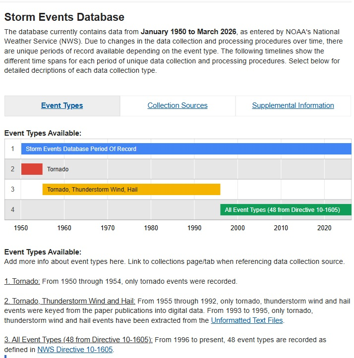

This is NOAA's own description of the database, and it is the single most important thing to understand before modelling anything. The database spans 1950 to today, but **it is not one homogeneous series**, it is three different data-collection regimes stacked end to end:

- **1950–1954**: only **tornado** events were recorded.
- **1955–1995**: **tornado, thunderstorm wind and hail**.
- **1996–present**: all **48 event types** defined in [NWS Directive 10-1605](https://www.ncei.noaa.gov/access/storm-events-database/about) are recorded.

## Pipeline

The scripts and notebooks are numbered in the order they run.

1. **`1_extraction.py`** Extracts the individual CSV files from the downloaded `.gz` archives.
2. **`2_merge.py`** Merges the extracted CSV files, year by year, into a single raw dataset spanning 1950–2025.
3. **`3_StormEvents_Cleaning_used.ipynb`** Assesses the missing values (which columns have gaps and how the missingness is distributed over time), then cleans the raw dataset: parses the damage strings, normalises the tornado intensity scale, groups the 56 raw event types into broader **event groups**, fills missing values, and drops columns that are unpopulated or redundant. Its output is the cleaned dataset used in all subsequent steps.
4. **`4_StormEvents_filling_text_generation_used.py`** Identifies every event missing an `EPISODE_NARRATIVE` or `EVENT_NARRATIVE` and generates the missing text with OpenAI's **`gpt-4o-mini`** through the **Batch API**. Rows that already have both narratives are never sent, and when one narrative exists it is passed to the model as context so the generated text stays consistent with it. The structured fields of the row (event type, state, dates, magnitude, damages, casualties…) are supplied as grounding context so the generated narrative is factual rather than invented.
5. **`5_StormEvents_embedding_augmentation_used.py`** Encodes the episode and event narratives with the **`all-MiniLM-L12-v2`** sentence-transformer model and applies dimensionality reduction, turning the free text into a compact set of numeric embedding features usable alongside the tabular columns. Embeddings could also be produced through the OpenAI API, GPT-family models, but `gpt-4o-mini` itself is used as a generative endpoint that returns text, not vectors. A local sentence-transformer was preferred here because it is purpose-built for sentence-level embeddings, producing a fixed-length numeric vector that captures each narrative's meaning, exactly the form needed for machine-learning features. 

   One could object that OpenAI's embedding models return richer vectors (1,536 dimensions or more, against MiniLM's 384) and should therefore capture more nuance. In this pipeline that advantage would be lost: the embeddings are not used raw but compressed by TruncatedSVD down to **10 components per narrative** (`ep_embedding_1..10`, `ev_embedding_1..10`), so both models funnel into the same small feature set and the extra dimensions would mostly be discarded. Vector size is also not a quality measure in itself. The two options were not compared in this project: this is a design choice, not a measured result.
6. **`6_StormEvents_feature_augmentation_used.py`** Asks `gpt-4o-mini`, again through the Batch API, to read each `EPISODE_NARRATIVE` and answer three questions, with one categorical label per answer:

   | New column | Question the LLM answers | Possible answers |
   |---|---|---|
   | `risk` | How dangerous was the episode? | high / medium / low |
   | `impact_type` | What was mainly affected? | casualties / property_damage / crop_damage / infrastructure_disruption / no_significant_impact |
   | `event_scope` | How large an area was affected? | localized / county-wide / regional / widespread |

   Each label is defined explicitly in the system prompt (e.g. `high` = deaths, injuries or major destruction occurred or were clearly likely) so the classification stays consistent across the whole dataset, and the model is instructed to judge only what the text states rather than assume unmentioned impacts. `impact_type` is not part of the published dataset: the column was dropped before the export of step 7, so the files in `data/` and all the models use only `risk` and `event_scope`.
7. **`7_export_github.py`** Splits the datasets into compressed Parquet parts small enough for GitHub and writes them to the `data/` folder.
8. **`8_EDA_used.ipynb`** Exploratory analysis of the final dataset: coverage over time, event-group composition, geography, damage and casualty trends, stationarity and seasonality of the monthly series, and the categorical drivers of impact. Some pictures below come from this notebook.
9. **`9_Global_estimation_count_v3.ipynb`**, **`9_Thunderstorm_estimation_count_v3.ipynb`**, **`9_Tornado_estimation_count_v3.ipynb`** Three parallel modelling notebooks that share one design and differ only in the slice of the database they cover. The split follows the collection-regime problem described above: Tornado and Thunderstorm have event records long before 1996, so they are modelled separately, while the remaining event groups are modelled together from 1996 onward.

   | Notebook | Scope | Period | Events 
   |---|---|---|---|
   | `9_Global_…` | the 11 event groups left after removing Tornado, Thunderstorm and the four almost-empty groups (`Geomagnetic`, `Volcanic`, `Tsunami`, `Marine_Other`) | 1996–2025 | 888,673 
   | `9_Thunderstorm_…` | `Thunderstorm` | 1955–2025 | 1,032,841 
   | `9_Tornado_…` | `Tornado` | 1950–2025 | 90,255 

   All three read the augmented dataset straight from the parquet files in `data/` and follow the same protocol. The target is a single count, **`CASUALTY`** (injuries plus deaths, direct and indirect). The data is **split by date first** (train through 2023, calibration 2024, test 2025) and only then filtered for zero-variance, redundant and high-cardinality features **using training rows alone**, so no test information reaches the design matrix. Each event also gets a set of **same-day context features** (how many events had already started that day nationwide, in the same group and in the same state, how many of them were high-risk or wide in scope, and the hours since the previous event of the same group in the same state), built from the predictors of earlier events only, never from their casualties, and one split at a time. Four models are fitted: a Poisson **GLM**, **LightGBM**, an **LSTM** and **TabPFN-3**. The GLM, LightGBM and LSTM hyperparameters are selected with expanding-window cross-validation over validation years, minimizing mean Poisson deviance; TabPFN-3 uses a fixed in-context configuration with a target-stratified context of up to 50,000 training rows. Every model is backtested on the same expanding-window folds and produces 90% adaptive conformal intervals. A last section measures how injuries and deaths move together, then splits the casualty prediction into injuries and deaths, direct and indirect, with fixed shares estimated on the training years, without fitting a second model.
10. **`10_Global_Tabular_Transformer_estimation_end_to_end_v0.ipynb`**, **`10_Thunderstorm_Tabular_Transformer_estimation_end_to_end_v0.ipynb`**, **`10_Tornado_Tabular_Transformer_estimation_end_to_end_v1.ipynb`** A fifth model for each slice: a **tabular transformer** written directly in PyTorch, where every feature of an event (each categorical column, each numeric column, the two narrative embeddings, the season and the year) becomes one token. It uses the same data, date split, target, context features, metrics, conformal intervals and backtest folds as the matching `9_…` notebook, so its results can be read side by side with the other four models. It is trained in two passes: the first holds out 2023 to choose the number of epochs, the second refits on all the training years, as the other models do. The notebook closes with an **interpretability** section that goes from single events (what changes the prediction when one piece of information is replaced with a plausible historical alternative, and how that information travels through the attention layers) to a check over a whole year (how much the error grows when one piece of information is shuffled). The process and its results are in the [Transformer interpretability](#transformer-interpretability) section.
11. **`11_Global_Estimation_Comparison_v3.ipynb`**, **`11_Thunderstorm_Estimation_Comparison_v3.ipynb`**, **`11_Tornado_Estimation_Comparison_v3.ipynb`** Load the saved results of the five models for one slice and compare them: point metrics by split plus the mean over the backtest years, conformal coverage and relative width, and the scores of the injuries / deaths split. The comparison pictures below come from these notebooks.

## What the data looks like

### Events per year

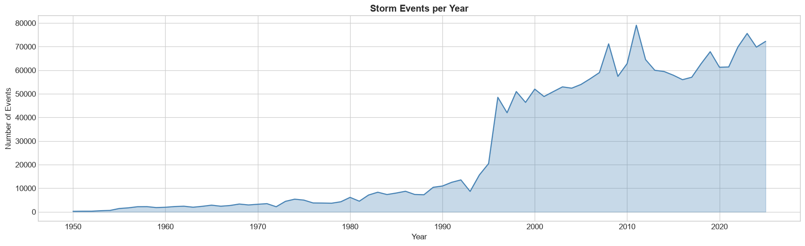

The yearly event count stays low and flat from the 1950s through the 1980s, rises in the early 1990s and then **jumps between 1995 and 1996**, the largest one-year change of the whole series. That vertical wall is not a climate signal: it is the 1996 switch to recording all 48 event types described above. After 1996 the series stays at a much higher level, between the 40,000 and the 80,000 lines of the chart, with its highest points around 2008, 2011 and in the most recent years.

### Composition by event group

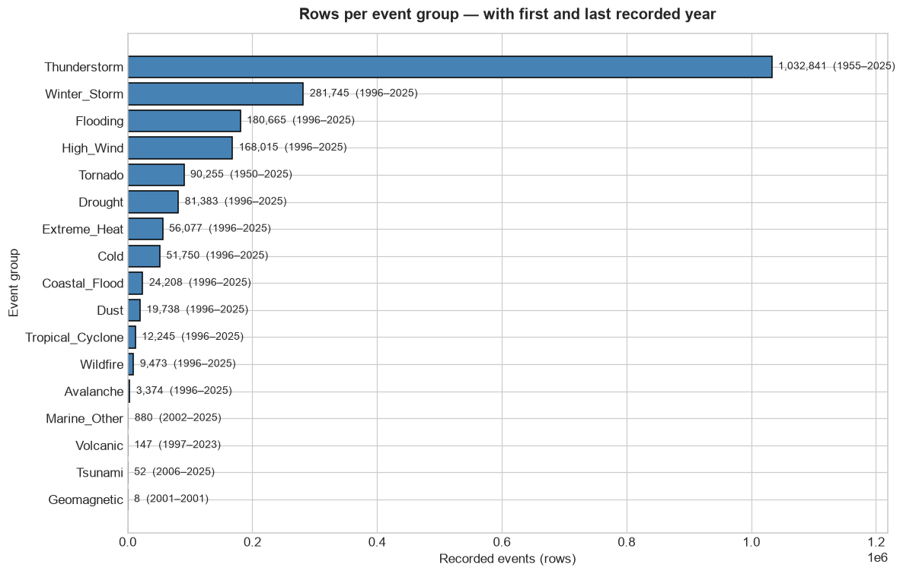

The 56 raw NOAA event types are collapsed into 17 broader **event groups**. The chart shows how many rows each group holds and the first/last year it appears, and it makes two things immediately clear.

First, the distribution is extremely **imbalanced**. `Thunderstorm` alone has 1,032,841 rows, far more than any other group (the second, `Winter_Storm`, has 281,745). At the other end, `Geomagnetic` has 8 rows, `Tsunami` 52 and `Volcanic` 147.

Second, the **start years confirm the collection-regime story**: `Tornado` starts in 1950 and `Thunderstorm` in 1955, while most other groups start in exactly 1996. A few start later (`Volcanic` 1997, `Geomagnetic` 2001, `Marine_Other` 2002, `Tsunami` 2006).

### Geographic distribution

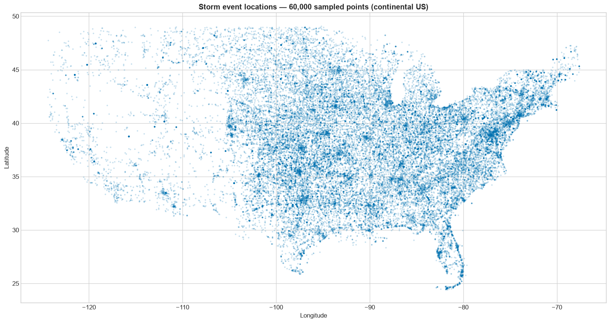

A 60,000-point sample of event coordinates over the continental U.S. The points are dense from the central Plains eastward to the Atlantic coast, along the Gulf coast and on the Florida peninsula. The West is comparatively sparse, with the events concentrated in a few clusters.

## Casualty-Count Modeling results

The unit of analysis is the **single storm event**: one row, one event. The target is **`CASUALTY`**, the total number of people injured or killed by the event (direct and indirect). Every model returns the **expected number of casualties for that event**, conditional on its characteristics and on what had already happened earlier the same day, with a Poisson objective (TabPFN-3 works on a transformed casualty rate and returns predictions on the count scale).

Models are ranked on **D2** (Poisson pseudo-R², high = better) and **mean Poisson deviance** (MPD, low = better), the two metrics consistent with the Poisson objective. RMSE appears in the comparison charts but is not used: squared errors are dominated by a handful of catastrophic events. MPD is on the scale of each slice, so it compares models within one slice, not across them. For the intervals, event-level predictions are summed by day and the 90% adaptive conformal interval is checked against the daily casualty total of 2025: **coverage** should sit near 0.90, and **RelWidth** (mean band width over mean daily actual) says how tight the band is.

**How the best model is chosen.** The 2025 test split is a single year. The **backtest** refits every model on five expanding-window folds (train ≤ 2018 → predict 2019, …, train ≤ 2022 → predict 2023), so its mean D2 and mean MPD are the main criterion; the 2025 test and the interval width break ties. The backtest means are the last column of each comparison chart.

The values in the tables below are those of the result tables in the `9_…` and `10_…` notebooks. The comparison charts, from the `11_…` notebooks, show the same values with two decimals.

| Slice | Best model | Backtest D2 | Backtest MPD | 2025 test D2 | 2025 test MPD | Coverage | RelWidth |
|---|---|---|---|---|---|---|---|
| Global | **TabPFN-3** | 0.4471 | 0.3410 | 0.5768 | 0.1841 | 0.9151 | 2.0646 |
| Thunderstorm | **Transformer** | 0.4624 | 0.0775 | 0.5003 | 0.0608 | 0.9171 | 2.4618 |
| Tornado | **TabPFN-3** | 0.6481 | 1.2588 | 0.3163 | 0.8927 | 0.9250 | 2.2011 |

The 2025 interval charts below are the best model's for each slice: monthly totals of the event-level predictions with the 90% adaptive conformal band, one panel per event group.

### Global — 11 event groups, 1996–2025

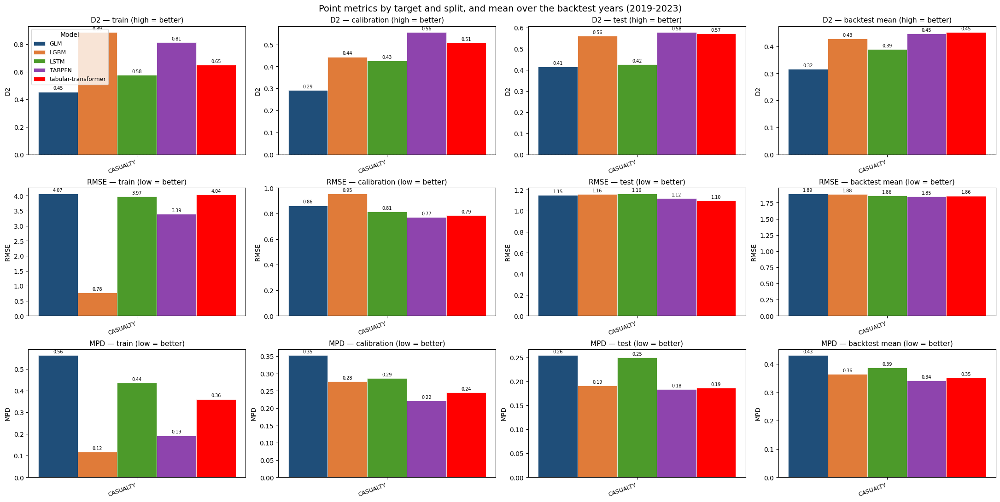

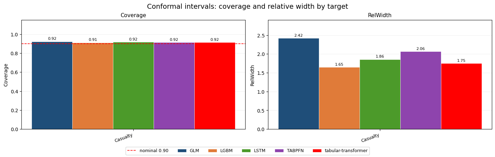

| Metric | GLM | LightGBM | LSTM | TabPFN-3 | Transformer |
|---|---|---|---|---|---|
| backtest D2 | 0.3163 | 0.4277 | 0.3894 | 0.4471 | **0.4516** |
| backtest MPD | 0.4305 | 0.3638 | 0.3860 | **0.3410** | 0.3509 |
| 2025 D2 | 0.4136 | 0.5595 | 0.4242 | **0.5768** | 0.5706 |
| 2025 MPD | 0.2550 | 0.1916 | 0.2504 | **0.1841** | 0.1867 |
| Coverage | 0.9233 | 0.9123 | 0.9178 | 0.9151 | 0.9151 |
| RelWidth | 2.4207 | **1.6469** | 1.8571 | 2.0646 | 1.7532 |

- **TabPFN-3 is the best model, by a narrow margin:** it has the lowest backtest MPD (0.3410) and leads on both 2025 metrics.
- **The transformer is level with it:** it has the highest backtest D2 (0.4516 against 0.4471), the second-lowest backtest MPD (0.3509) and a 2025 score just behind (MPD 0.1867 against 0.1841).
- **Year by year,** in the backtest tables of the notebooks, the lowest MPD alternates between the transformer, TabPFN-3 and LightGBM, and 2023 is the hardest year for every model.
- **Intervals:** coverage is between 0.91 and 0.92 for every model. TabPFN-3 pays for its accuracy with a wider band than LightGBM and the transformer (RelWidth 2.0646 against 1.6469 and 1.7532).

#### TabPFN-3 — conformal intervals by event group, 2025

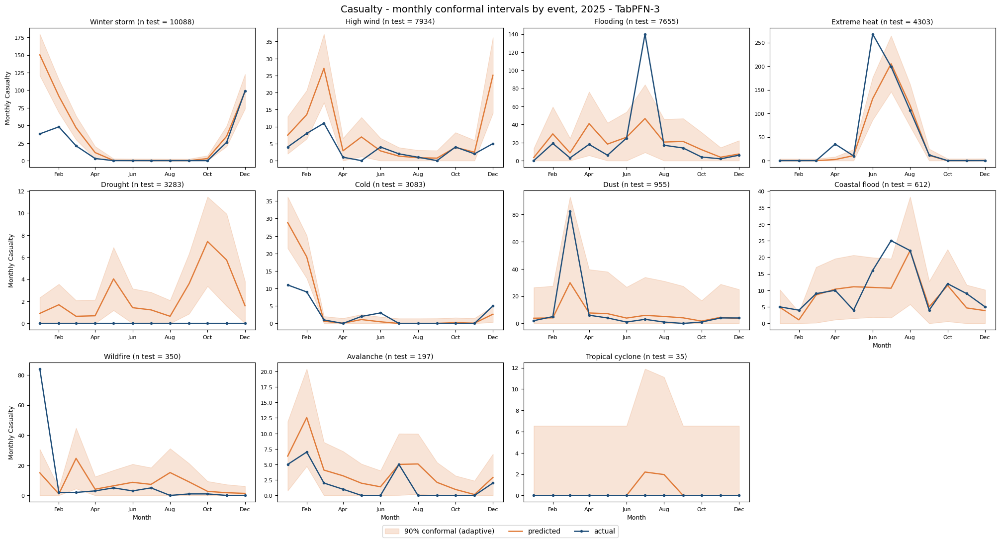

- **Tracked closely:** `Extreme_Heat` follows the summer peak, and `Coastal_Flood`, `Avalanche` and `Dust` stay inside the band almost all year, including the March spike of `Dust`.
- **Single episodes escape the band:** the recorded line rises above it for `Wildfire` in January, `Flooding` in July and `Extreme_Heat` in June.
- **Over-called in winter:** for `Winter_Storm` in January, `Cold` in January and February and `High_Wind` in December the recorded line falls below the band.
- **`Drought` and `Tropical_Cyclone` record zero casualties all year.** The model still expects a few, so the bands are wide, and in autumn the recorded line of `Drought` falls just below its band.

### Thunderstorm — 1955–2025

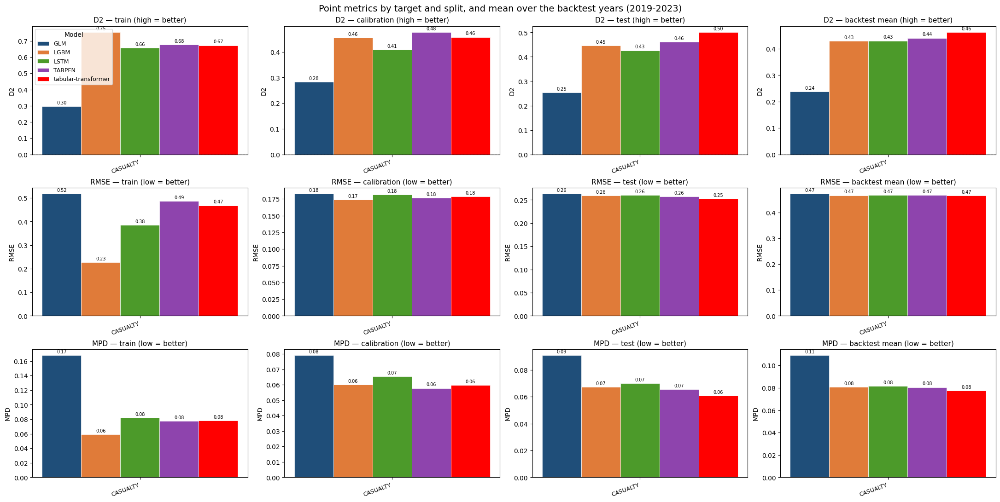

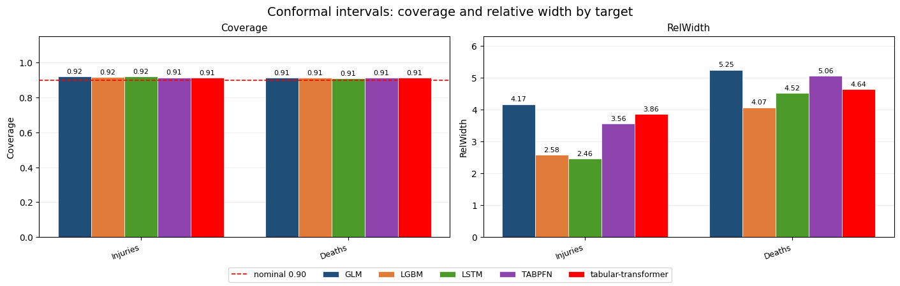

| Metric | GLM | LightGBM | LSTM | TabPFN-3 | Transformer |
|---|---|---|---|---|---|
| backtest D2 | 0.2386 | 0.4289 | 0.4305 | 0.4411 | **0.4624** |
| backtest MPD | 0.1092 | 0.0809 | 0.0814 | 0.0806 | **0.0775** |
| 2025 D2 | 0.2534 | 0.4465 | 0.4263 | 0.4613 | **0.5003** |
| 2025 MPD | 0.0909 | 0.0674 | 0.0698 | 0.0656 | **0.0608** |
| Coverage | 0.9116 | 0.9199 | 0.9144 | 0.9171 | 0.9171 |
| RelWidth | 3.8990 | 2.5273 | **2.4591** | 3.0640 | 2.4618 |

- **The transformer is the best model:** it leads on D2 and on MPD, on the backtest and on 2025 alike. Its band is practically as tight as the LSTM's (RelWidth 2.4618 against 2.4591).
- **LightGBM, the LSTM and TabPFN-3 are level behind it** (backtest MPD 0.0806–0.0814). The GLM is far behind (backtest D2 0.2386).
- **Year by year,** in the backtest tables of the notebooks, the transformer has the lowest MPD in three of the five years, and 2020 is the hardest year for every model.

#### Transformer — conformal intervals, 2025

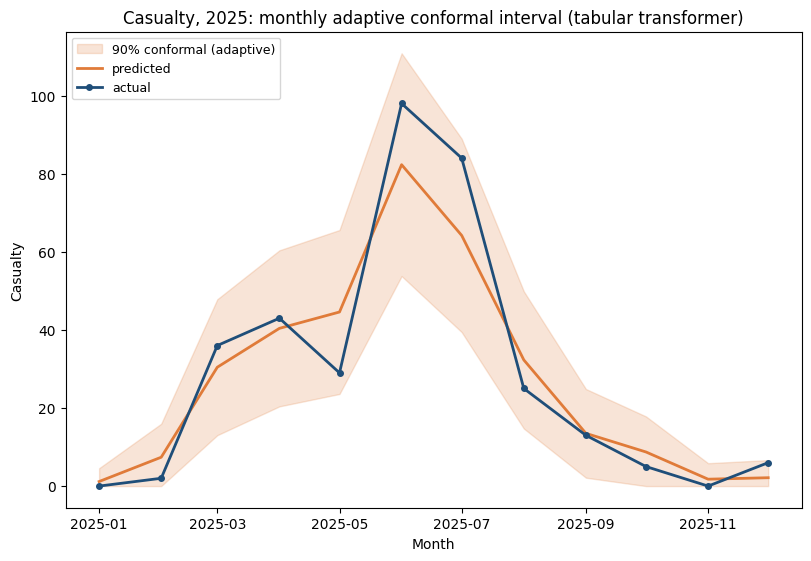

- **The prediction follows the seasonal shape,** rising from March and peaking in June.
- **Every month is inside the band.** The June and July peak is slightly under-called and May is over-called, but the recorded line never leaves the band.

### Tornado — 1950–2025

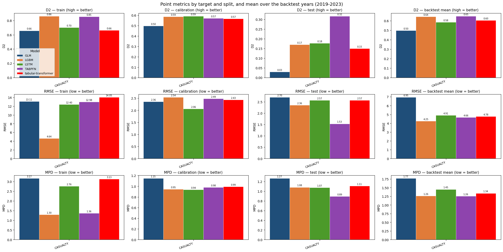

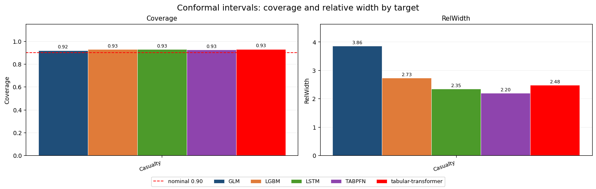

| Metric | GLM | LightGBM | LSTM | TabPFN-3 | Transformer |
|---|---|---|---|---|---|
| backtest D2 | 0.4982 | 0.6435 | 0.5845 | **0.6481** | 0.6049 |
| backtest MPD | 1.7696 | 1.2605 | 1.4523 | **1.2588** | 1.3394 |
| 2025 D2 | 0.0297 | 0.1704 | 0.1770 | **0.3163** | 0.1497 |
| 2025 MPD | 1.2669 | 1.0832 | 1.0746 | **0.8927** | 1.1102 |
| Coverage | 0.9194 | 0.9278 | 0.9278 | 0.9250 | 0.9306 |
| RelWidth | 3.8573 | 2.7275 | 2.3460 | **2.2011** | 2.4836 |

- **TabPFN-3 is the best model:** it is level with LightGBM on the backtest (MPD 1.2588 against 1.2605, D2 0.6481 against 0.6435) and clearly ahead on 2025 (D2 0.3163, against 0.1497–0.1770 for the other nonlinear models), with the tightest band.
- **2025 is a hard year for every model:** the D2 of the nonlinear models goes from 0.5845–0.6481 on the backtest to 0.1497–0.3163, and the GLM is close to zero (0.0297).
- **Coverage is between 0.92 and 0.93 for every model.**

#### TabPFN-3 — conformal intervals, 2025

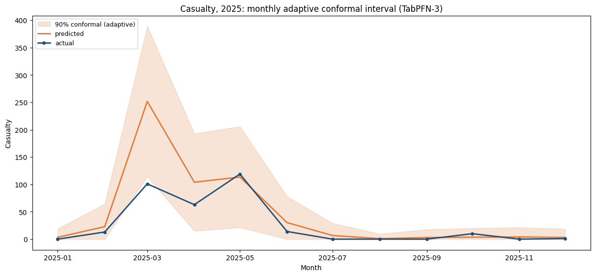

- **The spring is over-called:** in March and April the predicted line is well above the recorded one, and in March the recorded line sits on the lower edge of the band.
- **May is on target,** and the quiet months from June to December are near zero and well covered.
- **The band is widest in March,** the month with the highest prediction.

### From casualties to injuries and deaths

Each model predicts one number per event, `CASUALTY`. NOAA records it in **four categories**: injuries and deaths, each either **direct** (caused by the event itself) or **indirect** (caused by something the event set off). The `9_…` and `10_…` notebooks check whether the single prediction can be split into those categories **without a second model**. Every table in this section is an output of those notebooks or of the `11_…` comparison notebooks, with the same values.

#### How injuries and deaths move together

Two correlations are reported because they answer different questions. **Pearson** measures agreement of the values and is driven by the few very large events. **Spearman** measures agreement of the rankings and gives small and large events the same weight.

| Slice | Split | Events | Pearson | Spearman | Pearson without large events | P(deaths > 0 given injuries > 0) | P(deaths > 0 given injuries = 0) | Death share |
|---|---|---|---|---|---|---|---|---|
| Global | train | 812,807 | 0.0407 | 0.1973 | 0.0667 | 0.2395 | 0.0100 | 0.2363 |
| Global | test | 38,495 | 0.0496 | 0.2266 | 0.0841 | 0.3405 | 0.0088 | 0.4859 |
| Thunderstorm | train | 970,919 | 0.1083 | 0.1625 | 0.1139 | 0.0826 | 0.0014 | 0.1085 |
| Thunderstorm | test | 31,932 | 0.1671 | 0.1875 | 0.1671 | 0.1168 | 0.0011 | 0.1994 |
| Tornado | train | 86,063 | 0.7418 | 0.3893 | 0.4786 | 0.1804 | 0.0035 | 0.0598 |
| Tornado | test | 1,776 | 0.2984 | 0.3572 | 0.2984 | 0.2105 | 0.0053 | 0.1994 |

"Large events" are those with more than 100 casualties. "P(deaths > 0 given injuries > 0)" is the share of events with injuries that also have deaths. "Death share" is deaths over all casualties.

- **Tornado: injuries and deaths rise together.** Pearson is 0.74 on the training years. Much of that link comes from the largest events: without them Pearson falls to 0.48, and on the 2025 test it is 0.30.
- **Global: almost no link** (Pearson 0.04, Spearman 0.20). An event that injures someone also kills someone in 0.24 of the cases, but the number injured says little about the number of deaths.
- **Thunderstorm: a weak link** (0.11 and 0.16). Deaths are rare: 0.08 of the events that injure someone also kill someone.
- **The death share is not stable over time.** From the training years to the 2025 test it goes from 0.24 to 0.49 on the global slice, from 0.11 to 0.20 on thunderstorm and from 0.06 to 0.20 on tornado.

#### 2025 test results by category

The split is a fixed proportion: each predicted casualty count is multiplied by the share the category holds over the **training years**, and the product is scored against the recorded value. The same shares are applied to every model.

Three scores are reported for each category and model. **D2** can be compared across categories. **MPD** cannot, because it is on the scale of each category, so it compares models within one row only. **Ratio** is the total predicted over the total recorded: 1 means the level is right, below 1 the category is under-called, above 1 it is over-called. The best D2 and MPD of each row are in bold.

**Global**

| Category | Score | GLM | LightGBM | LSTM | TabPFN-3 | Transformer |
|---|---|---|---|---|---|---|
| Injuries, direct | D2 | 0.2159 | 0.4566 | 0.2821 | **0.5059** | 0.4073 |
| | MPD | 0.1652 | 0.1145 | 0.1513 | **0.1041** | 0.1249 |
| | Ratio | 1.7808 | 1.2653 | 1.3584 | 1.7808 | 1.4389 |
| Injuries, indirect | D2 | 0.1336 | 0.3556 | 0.2898 | 0.3527 | **0.4335** |
| | MPD | 0.0791 | 0.0588 | 0.0648 | 0.0591 | **0.0517** |
| | Ratio | 1.1741 | 0.8342 | 0.8956 | 1.1741 | 0.9487 |
| Deaths, direct | D2 | **0.5094** | 0.4370 | 0.3362 | 0.4181 | 0.4707 |
| | MPD | **0.0741** | 0.0850 | 0.1003 | 0.0879 | 0.0799 |
| | Ratio | 0.6213 | 0.4414 | 0.4739 | 0.6212 | 0.5020 |
| Deaths, indirect | D2 | 0.4071 | 0.4518 | 0.4406 | 0.4549 | **0.4917** |
| | MPD | 0.0448 | 0.0414 | 0.0423 | 0.0412 | **0.0384** |
| | Ratio | 0.3147 | 0.2236 | 0.2401 | 0.3147 | 0.2543 |

- **No model wins all four categories:** TabPFN-3 is best on direct injuries, the transformer on both indirect categories, and the GLM on direct deaths.
- **The level is off, in opposite directions:** every model predicts too few deaths (ratio 0.44–0.62 for direct deaths, 0.22–0.31 for indirect ones) and too many direct injuries (ratio 1.27–1.78). This comes mostly from the fixed share rather than from the models: the death share was 0.24 in training and 0.49 in 2025.

**Thunderstorm**

| Category | Score | GLM | LightGBM | LSTM | TabPFN-3 | Transformer |
|---|---|---|---|---|---|---|
| Injuries, direct | D2 | 0.2317 | 0.4172 | 0.4090 | 0.4290 | **0.4794** |
| | MPD | 0.0665 | 0.0504 | 0.0511 | 0.0494 | **0.0450** |
| | Ratio | 1.8852 | 1.1810 | 1.0316 | 1.5650 | 1.1913 |
| Injuries, indirect | D2 | 0.1508 | 0.2810 | 0.2425 | 0.2706 | **0.2900** |
| | MPD | 0.0192 | 0.0163 | 0.0172 | 0.0165 | **0.0161** |
| | Ratio | 0.6527 | 0.4089 | 0.3572 | 0.5419 | 0.4125 |
| Deaths, direct | D2 | 0.1960 | 0.3616 | 0.3308 | 0.4010 | **0.4014** |
| | MPD | 0.0204 | 0.0162 | 0.0170 | **0.0152** | **0.0152** |
| | Ratio | 0.8364 | 0.5239 | 0.4577 | 0.6943 | 0.5285 |
| Deaths, indirect | D2 | 0.1669 | 0.2388 | 0.2162 | **0.2436** | 0.2274 |
| | MPD | 0.0035 | **0.0032** | 0.0033 | **0.0032** | 0.0033 |
| | Ratio | 0.7859 | 0.4923 | 0.4301 | 0.6524 | 0.4966 |

- **The transformer keeps its lead:** it is best on both injury categories and level with TabPFN-3 on direct deaths, the same order as on the casualty target.
- **The indirect categories are harder:** D2 stays at 0.15–0.29, against 0.20–0.48 on the direct ones.
- **Deaths are under-called here too:** the ratio for direct deaths is 0.46–0.84.

**Tornado**

| Category | Score | GLM | LightGBM | LSTM | TabPFN-3 | Transformer |
|---|---|---|---|---|---|---|
| Injuries, direct | D2 | -0.2128 | -0.0397 | -0.0312 | **0.1599** | -0.0677 |
| | MPD | 1.2679 | 1.0870 | 1.0781 | **0.8783** | 1.1162 |
| | Ratio | 3.5491 | 2.8691 | 2.8428 | 2.0683 | 2.5375 |
| Injuries, indirect | D2 | 0.5272 | 0.4621 | **0.5760** | 0.4598 | 0.5060 |
| | MPD | 0.0342 | 0.0389 | **0.0307** | 0.0391 | 0.0357 |
| | Ratio | 0.2714 | 0.2194 | 0.2174 | 0.1581 | 0.1940 |
| Deaths, direct | D2 | 0.4937 | **0.5155** | 0.4901 | 0.4617 | 0.5125 |
| | MPD | 0.1706 | **0.1633** | 0.1718 | 0.1814 | 0.1643 |
| | Ratio | 0.8714 | 0.7044 | 0.6980 | 0.5078 | 0.6230 |
| Deaths, indirect | D2 | NaN | NaN | NaN | NaN | NaN |
| | MPD | 0.0005 | 0.0004 | 0.0004 | 0.0003 | 0.0003 |
| | Ratio | NaN | NaN | NaN | NaN | NaN |

- **Direct injuries carry the 2025 miss:** every model predicts between 2.1 and 3.5 times the recorded number (ratio 2.07–3.55), the same spring over-call seen in the interval chart. D2 is negative for every model except TabPFN-3 (0.16).
- **Direct deaths are scored well by every model** (D2 0.46–0.52), although the level is low (ratio 0.51–0.87).
- **Indirect deaths cannot be scored:** D2 and the ratio are not defined (NaN), which is what happens when a year has no recorded casualty of that category.

### Takeaways

- **No single model wins everywhere.** TabPFN-3 is the best choice on the global and tornado slices, the transformer on thunderstorm.
- **The transformer is competitive on every slice.** It is best on thunderstorm and level with TabPFN-3 on global.
- **The GLM is the floor.** It is interpretable and stable, but it trails on every slice and falls to a D2 of 0.0297 on tornado 2025.
- **Intervals are calibrated everywhere** (coverage between 0.91 and 0.93). What they cannot catch are single extreme months, such as the wildfire, flooding and extreme-heat peaks of the global chart.
- **One test year can mislead.** Tornado 2025 is much harder than the backtest years for every model, so test, backtest and the monthly interval charts must be read together.
- **Injuries and deaths are closely linked only for tornadoes** (Pearson 0.74, against 0.04 on the global slice and 0.11 on thunderstorm).
- **A fixed split ranks events well but misses the level when the mix changes.** In 2025 the death share is two to three times the training one, so every model under-calls deaths and over-calls direct injuries.
- **The narratives matter.** On the global and thunderstorm slices the event narrative and the features read from it are what the transformer depends on most (see the next section).

## Transformer interpretability

The `10_…` notebooks end with a section that opens the transformer and explains its predictions: which information moves a prediction, how the prediction is put together, and how that information travels inside the network. Everything is computed with the **same fitted model**. No simplified stand-in model is trained to explain it.

One rule holds throughout: **prediction impact comes first.** Attention shows where the model looks, not what changes the result, so it is read as a description of the mechanism and never as a ranking of feature importance.

The notebooks explain six events per group, each with four charts. This section shows, for each group, a check over the whole year and then two single events chosen as the most representative: one failure and one well-predicted event.

Every chart is presented the same way: a **title in bold** that says what the chart is about, then the chart, then a few comments on it. The comments always refer to the chart just above them and use only the numbers printed on it. A line in italics, *How to read it*, explains each kind of chart the first time it appears, in the Global results, and applies to the same kind of chart in the other two groups. Each group closes with conclusions that draw on all six events of the notebook, to give the complete picture.

### How the transformer reads an event

Three things are needed to follow the charts.

- **Tokens.** Each piece of information about an event (the state, the reporting source, the duration, each narrative embedding, the month, the year…) becomes one token. An extra **summary token**, called CLS in the transformer literature, is added in front. An event is 19 tokens on the global group, 23 on thunderstorm and 22 on tornado.
- **Encoder.** The tokens exchange information with each other through attention layers, so each one ends up carrying context from the others.
- **Decoder and output.** The summary token then reads the encoded tokens once more, again through attention, and a final layer turns it into the expected number of casualties.

Attention works through three quantities, usually shortened to **Q/K/V**: the **query** (what the summary token is looking for), the **key** (what each token offers to be matched on) and the **value** (the content a token passes on if it is selected).

### The process

**The six stages of the process**

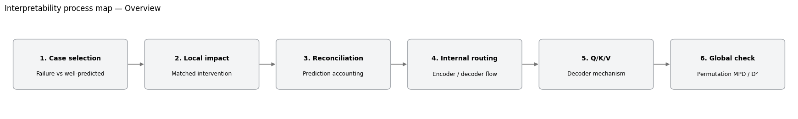

The process goes from single events to a whole year, and from "what changes the prediction" to "how the network does it". The table below is the technical reference for each stage. The results further down repeat, in plain words, how to read each chart.

| Stage | Question | How it is answered | How to read the chart |
|---|---|---|---|
| 1. Case selection | Which events are worth explaining? | Among the 2025 test events in the top quarter of non-zero casualty counts, the three with the largest absolute error (**failure** cases) and the three with the smallest (**well-predicted** cases). | A table with the recorded and the predicted casualties. |
| 2. Local impact | What happens to the prediction if one piece of information were different? | That piece is replaced with the values of 32 similar historical events, and the model predicts again each time. | Bar = median change in expected casualties, line = 10th to 90th percentile. A bar to the right means the original information raises the prediction. Green means it brings the prediction closer to the recorded count, red means it takes it further away. "Stable direction" means the whole 10th to 90th percentile range is on one side of zero; otherwise the effect is "reference-sensitive", that is, it depends on which historical event is used as replacement. |
| 3. Reconciliation | How does the model get from a typical similar event to this exact prediction? | The prediction for 16 similar historical events is the starting point. The event's own information is then added in every possible combination, which separates the effect of each piece alone, of each pair, and of three or more together. | A waterfall that adds up exactly to the prediction. The gap between prediction and recorded count is model error and is reported apart. |
| 4. Internal routing | Where does that information travel inside the network? | Three shares per piece of information: how much of it reaches the summary token through the encoder, how much attention the decoder gives it, and the same attention weighted by how sensitive the prediction is to it (attention × gradient). | Shares in percent: **dominant** from 15%, **moderate** from 5% to 15%, **weak** below 5%. A share is not a contribution to the casualty count. |
| 5. Q/K/V | Why does the decoder pick and pass on that information? | Three shares again: what the summary token selects (Q–K selection), how much content each token has to offer (V payload), and what is actually delivered once the two are combined (delivered V). | Same bands as stage 4. |
| 6. Global check | Does the model depend on the same information over a whole year? | One piece of information at a time is shuffled across all the events of 2024 and of 2025, five times, and the error is measured again. | Bar = increase in MPD. A long bar means the model depends on that information. A bar to the left of zero means the model was better off without it that year. |

Three choices apply to every stage:

- **Information that belongs together moves together.** State, forecast office and time zone form one **geography block** (state and forecast office on thunderstorm). The event narrative embedding and the `risk` and `event_scope` labels read from the narratives form one **event narrative block**. Changing only one of them would create an event that cannot exist, such as a Texas county served by a Florida forecast office.
- **Replacements are real and similar.** They come from training-year events matched on the other characteristics of the event, such as place, reporting source, duration, same-day context, season and year. The casualties are never used for the matching.
- **The explanation is checked against the model.** The calculation that extracts the attention gives the same predictions as the model itself, and each notebook prints this check.

### Results: Global

#### The whole year

**Whole-year check: which information the model needs most**

*How to read it: each row is one piece of information. The bar shows how much the model's error grows when that information is scrambled across all the events of a year, blue for 2024 and orange for 2025. A long bar means the model needs that information. A bar near zero means it barely uses it.*

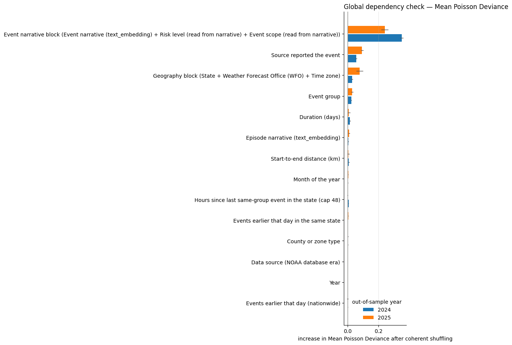

- **The event narrative block comes first.** When it is scrambled the error grows far more than for any other piece of information, in 2024 and in 2025 alike. Over a whole year the model's accuracy rests above all on what the narrative says.
- **The reporting source, the geography block and the event group follow at a distance,** with bars several times shorter.
- **The same-day context features, the year and the data source have bars close to zero:** scrambling them leaves the error almost unchanged, so the model barely uses them.

#### Failure: Texas, 4 July 2025 (61 casualties recorded, 0.77 predicted)

**Local impact: what pushed this prediction up or down**

*How to read it: each row is one piece of information about this event, with its value. The bar shows how much the prediction changes because of it: to the right it raises the prediction, to the left it lowers it. Green means it moved the prediction towards what really happened, red means away from it. The thin line shows how much the answer varies depending on which past event it is compared with, and "stable direction" means it always points the same way.*

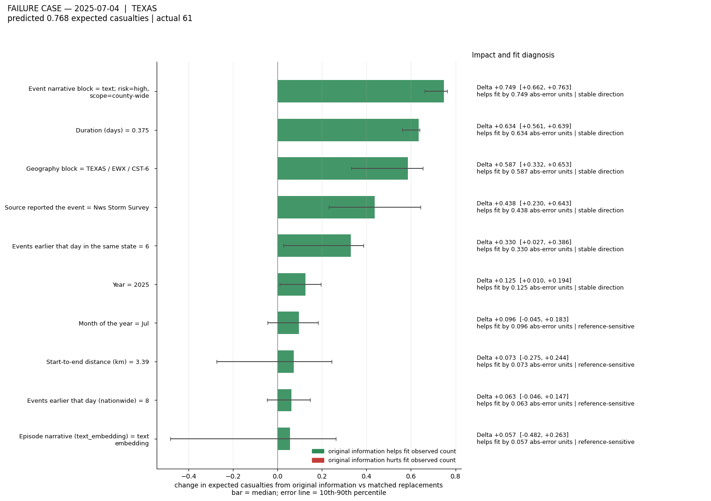

- **Every piece of information raises the prediction,** the six largest with a stable direction: the narrative block (`risk` = high, `event_scope` = county-wide) by 0.75, the duration by 0.63, the geography block by 0.59, the reporting source by 0.44.
- **All bars are green:** each one moves the prediction towards the recorded count. Together they reach 0.77, against 61 recorded.

**Reconciliation: how the prediction is built, step by step**

*How to read it: read from top to bottom. The first row is what the model predicts for similar past events. Each following row adds something, and the last row is the prediction. Blue rows are one piece of information on its own, purple rows are two pieces acting together, the brown row is three or more acting together. The numbers on the right are the amount added and the running total.*

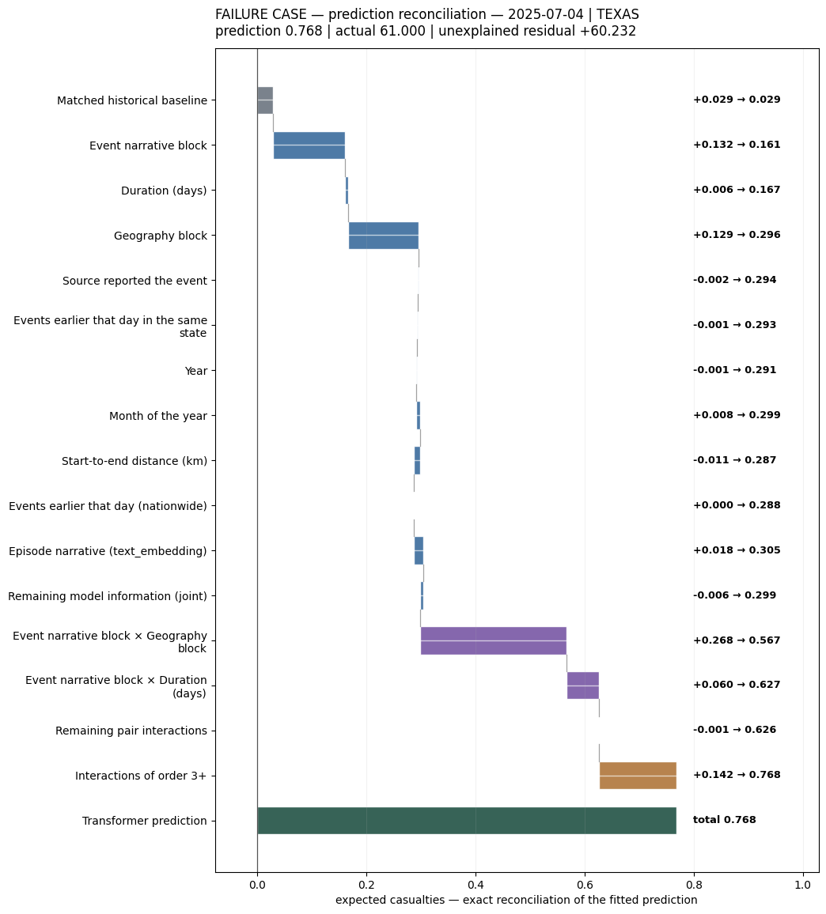

- **Similar past events are predicted at 0.03.** This event's own information takes the prediction to 0.77.
- **Information acting together weighs more than each piece alone.** Alone, the narrative block adds 0.13 and the geography block 0.13. Together, as a pair, they add another 0.27. Three or more pieces together add 0.14.
- **The remaining 60.2 casualties are not explained by any input:** they are the model's error, shown in the title of the chart and kept out of the steps.

**Internal routing: where the information travels inside the model**

*How to read it: three panels, each showing shares that add up to 100%. Left ("Encoder -> CLS"): how much of each piece of information reaches the summary token through the encoder. Middle ("Decoder attention"): how much attention the decoder gives each piece when it produces the prediction. Right ("Attention x gradient"): the same attention, weighted by how much it matters for the result. The words "dominant", "moderate" and "weak" mark large, medium and small shares. These are shares of the traffic inside the model, not casualties.*

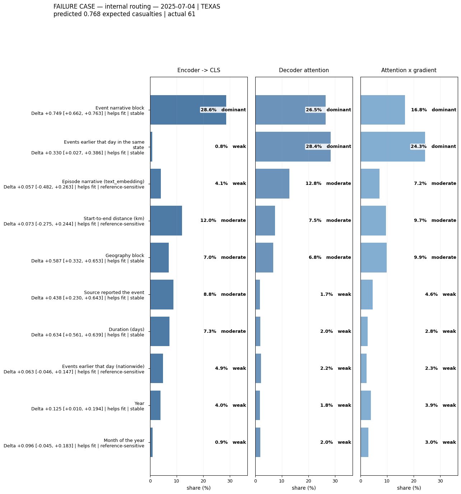

- **The narrative block has a large share in all three panels:** 28.6% on the left, 26.5% in the middle, 16.8% on the right.
- **Attention and impact do not match.** The events earlier that day in the same state receive the largest share of the decoder attention (28.4%, middle panel), and changed the prediction by 0.33. The duration changed it by 0.63 and receives 2.0% of the decoder attention. The reporting source changed it by 0.44 and receives 1.7%.

**Q/K/V: what the model selects and what it passes on**

*How to read it: three panels again. Left ("Q-K selection"): how much the decoder selects each piece of information. Middle ("V payload"): how much content that piece has to offer. Right ("Delivered V"): what actually gets passed on to the final calculation. A piece of information delivers a lot only if it is both selected and rich in content.*

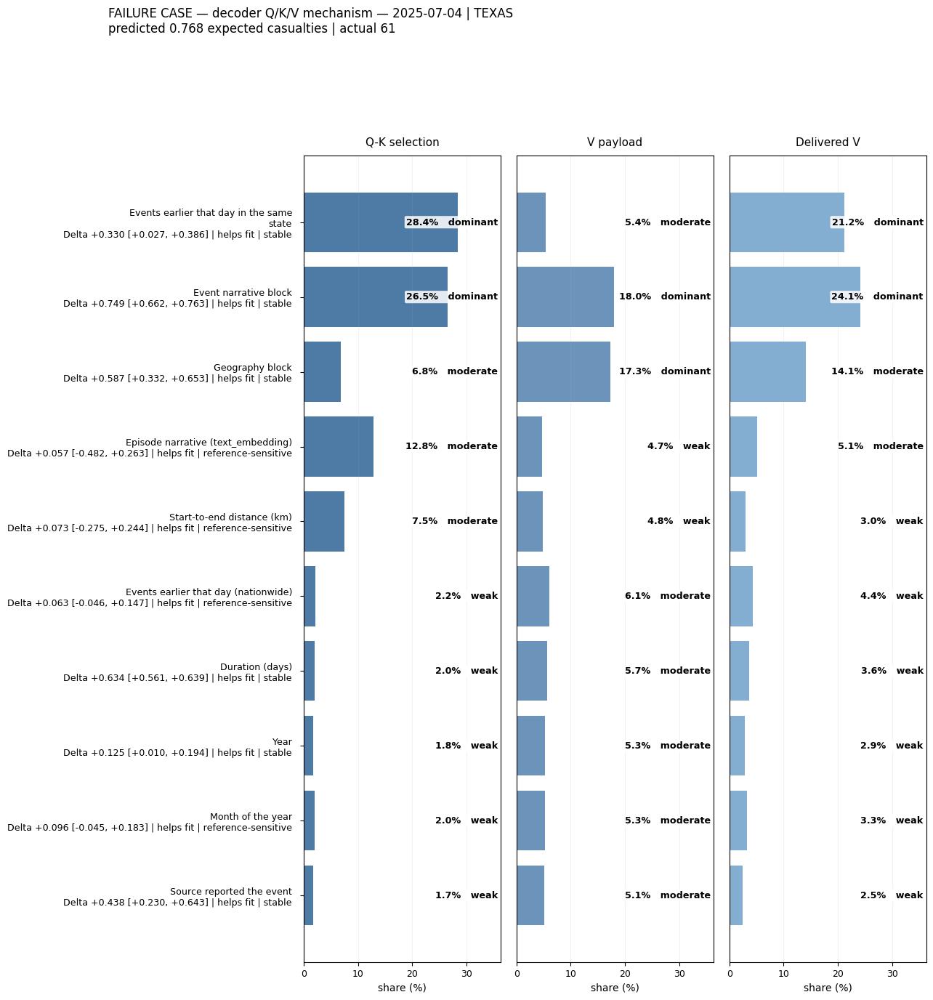

- **The narrative block is both selected (26.5%) and rich in content (18.0%),** and delivers the most (24.1%).
- **The events earlier that day in the same state are selected most (28.4%) but carry little content (5.4%).** The geography block is the reverse: selected little (6.8%), rich in content (17.3%), and it still delivers 14.1%.

#### Well-predicted: Oregon, 19 October 2025 (2 casualties recorded, 1.95 predicted)

**Local impact: what pushed this prediction up or down**

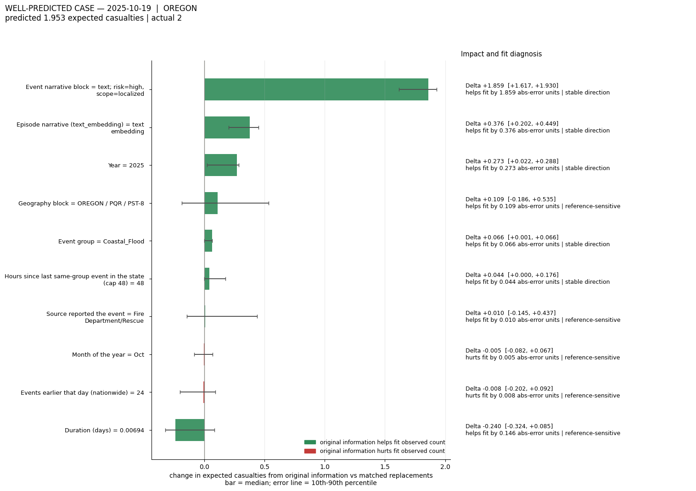

- **The narrative block carries the prediction:** replacing it lowers the prediction by 1.86 of the 1.95, with a stable direction (`risk` = high, `event_scope` = localized).
- **The episode narrative (+0.38) and the year (+0.27) add to it,** both with a stable direction. The very short duration takes 0.24 off.

**Internal routing: where the information travels inside the model**

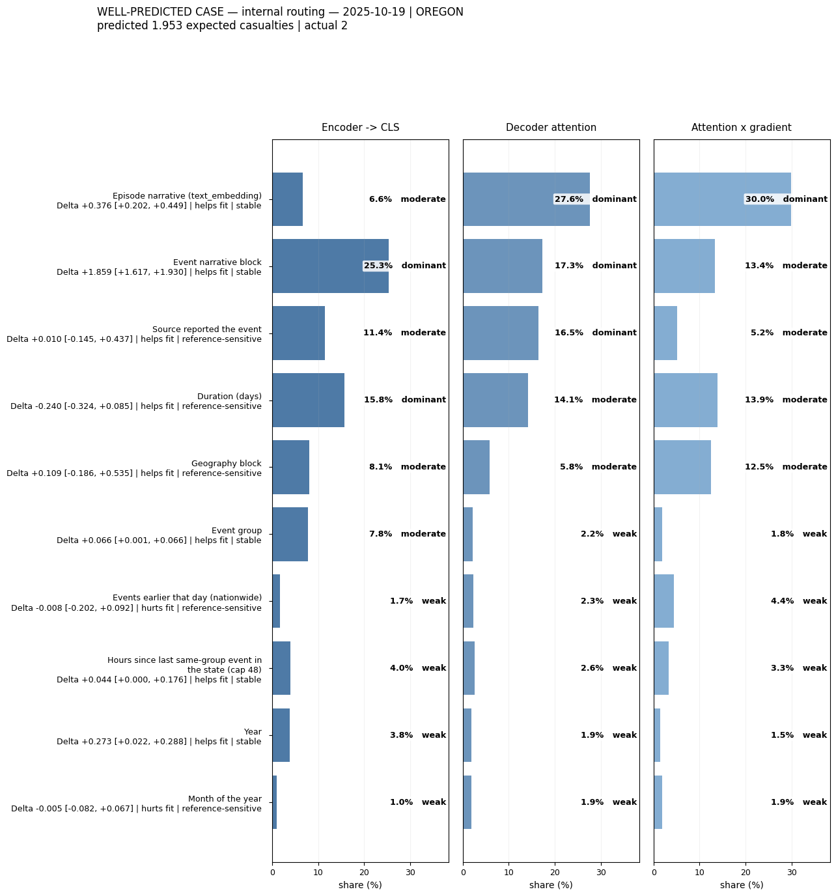

- **The narrative block has the largest share in the left panel (25.3%)** and a large one in the middle panel too (17.3%).
- **Attention and impact do not match here either.** The episode narrative receives the largest share of the decoder attention (27.6%, middle panel) and changed the prediction by 0.38, against 1.86 for the narrative block. The reporting source receives 16.5% of the decoder attention and changed the prediction by 0.01.

**Q/K/V: what the model selects and what it passes on**

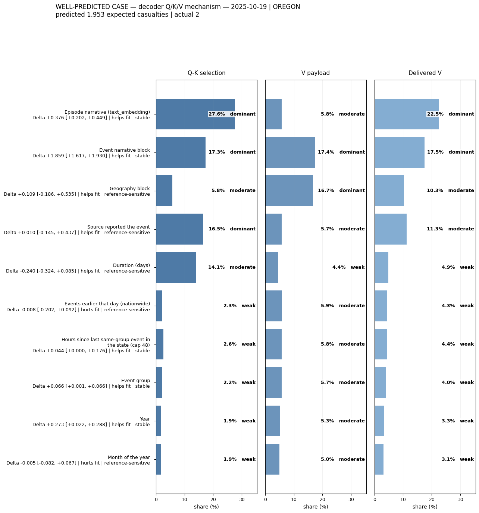

- **The same mechanism as in the failure.** The episode narrative is selected most (27.6%) with little content (5.8%), and delivers 22.5%. The narrative block is even across the three panels (17.3%, 17.4%, 17.5%). The geography block is selected little (5.8%) but rich in content (16.7%), and delivers 10.3%.

#### Conclusions

These draw on all six events explained in the notebook, not only on the two shown above.

- **The event narrative block is what the model depends on most,** over the whole year and in the single events: it is the largest driver in four of the six explained events, including the three well-predicted ones.
- **The same driver produces the success and the failure.** What the narrative says is enough to get an ordinary event right, and not enough to tell a 61-casualty event from it.
- **The three failures are very large events predicted far too low:** 166, 90 and 61 casualties recorded against 0.06, 21.4 and 0.77 predicted.
- **A prediction is built mostly from information acting together,** above all the narrative block with the others, more than from any single piece.
- **Attention is not importance.** The information that receives the most decoder attention is not the one that moves the prediction most, in the failure and in the well-predicted event alike.

### Results: Thunderstorm

#### The whole year

**Whole-year check: which information the model needs most**

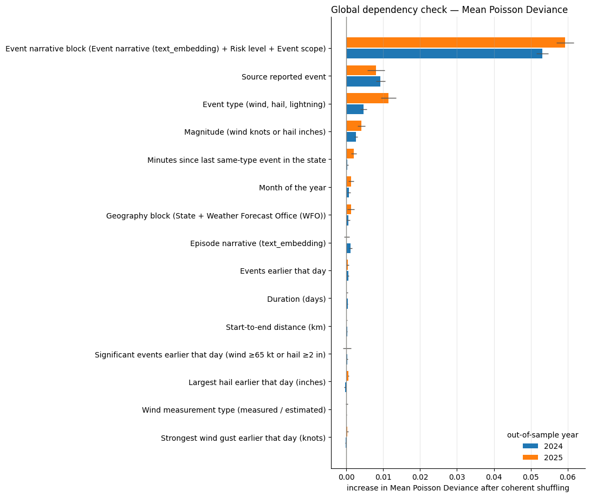

- **The event narrative block comes first by a wide margin.** Its two bars are several times longer than any other, and of similar length in 2024 and 2025: the model depends on the narrative in the same way in both years.
- **The reporting source, the event type and the magnitude follow,** all with short bars.
- **The geography block and the same-day context features are close to zero:** where the event happened and what happened earlier that day hardly change the error.

#### Failure: South Carolina, 24 June 2025 (20 casualties recorded, 2.10 predicted)

**Local impact: what pushed this prediction up or down**

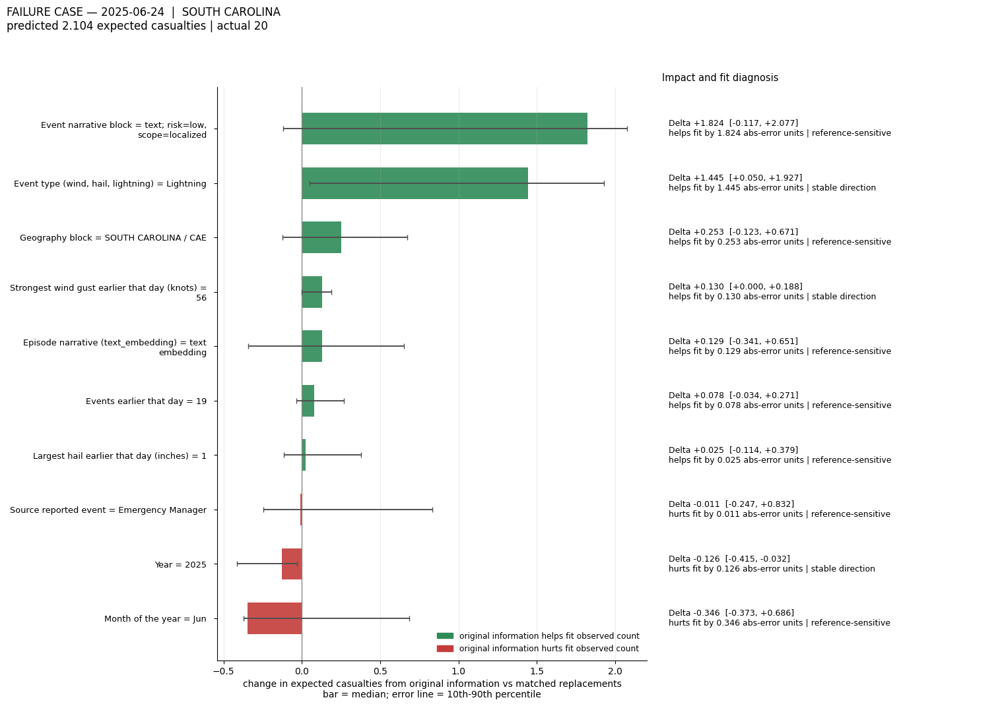

- **Two pieces of information make the prediction:** the narrative block (+1.82) and the event type, lightning (+1.45). Both are green: they push towards the recorded count.
- **The year and the month lower it** (−0.13 and −0.35). They are red: they take the prediction further from what happened.

**Reconciliation: how the prediction is built, step by step**

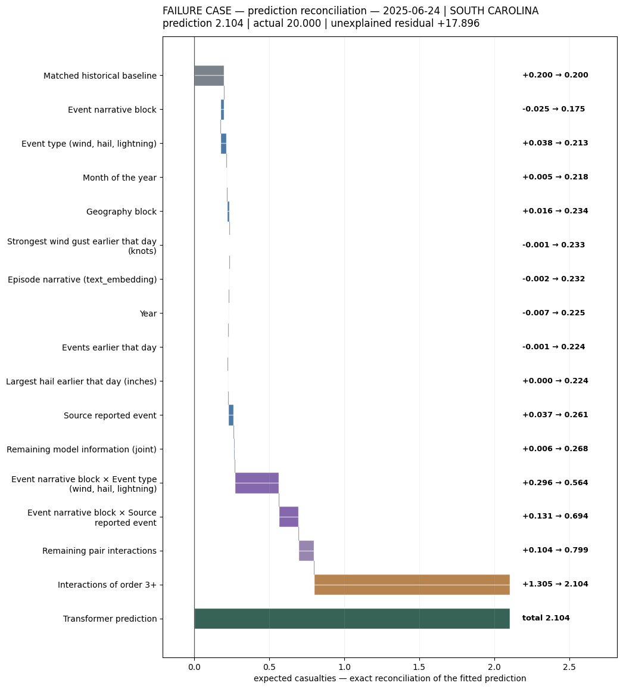

- **Similar past events are predicted at 0.20.** No single piece of information adds more than 0.04 on its own.
- **The prediction comes from information acting together.** The narrative block with the event type adds 0.30 as a pair, and three or more pieces together supply 1.3 of the 2.1.
- **The remaining 17.9 casualties are the model's error.**

**Internal routing: where the information travels inside the model**

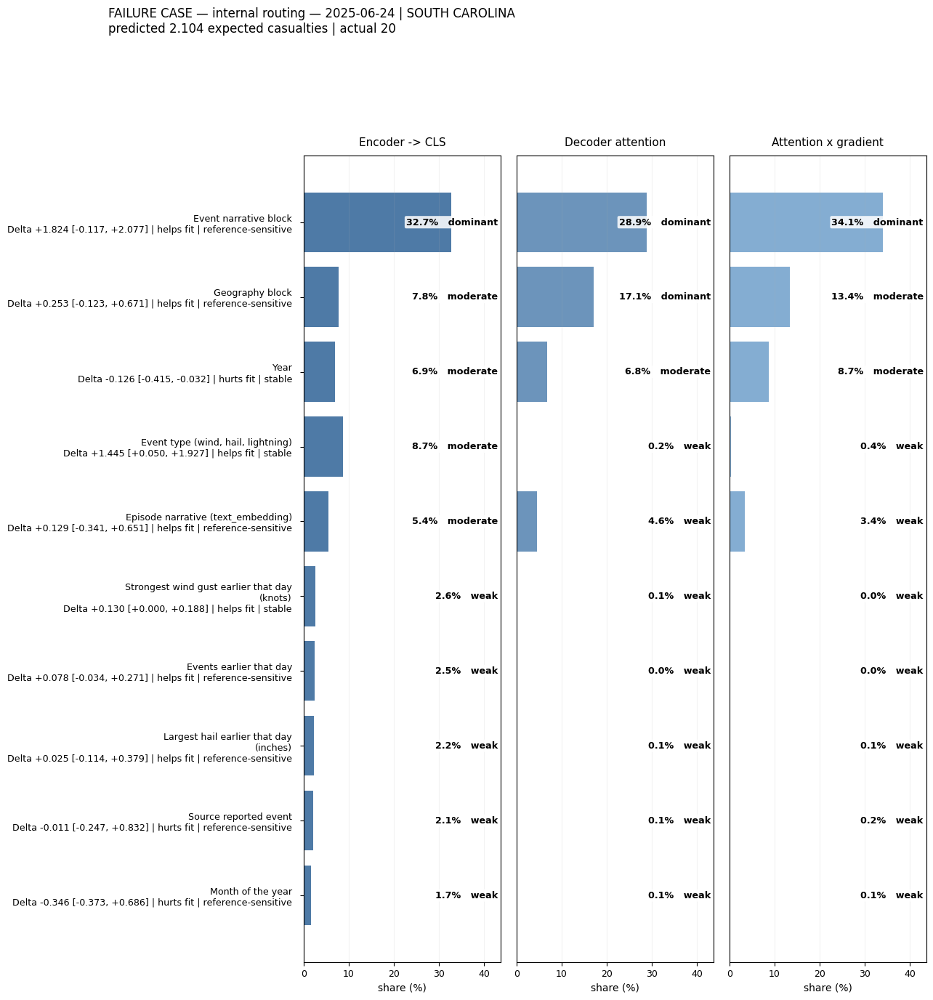

- **The narrative block has the largest share in all three panels:** 32.7% on the left, 28.9% in the middle, 34.1% on the right.
- **The event type matters without decoder attention.** It changed the prediction by 1.45, yet it receives 0.2% of the decoder attention (middle panel). It appears only in the left panel, through the encoder (8.7%).

**Q/K/V: what the model selects and what it passes on**

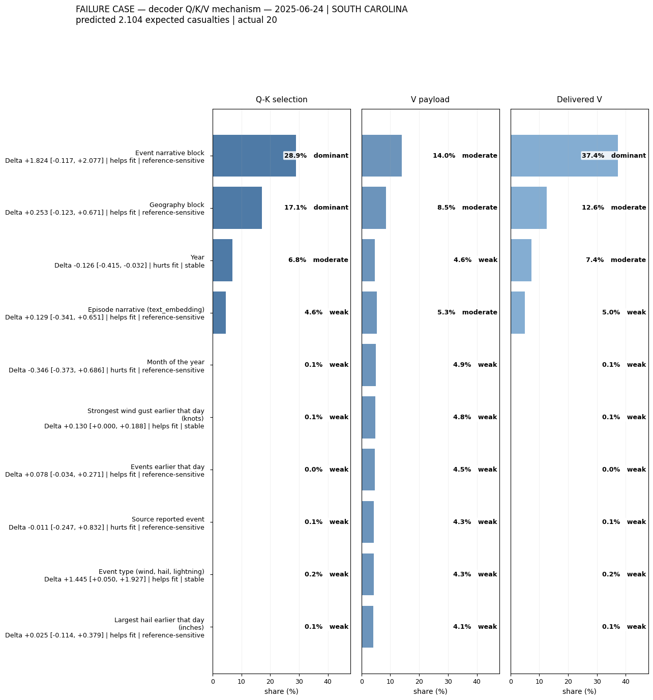

- **The decoder selects four pieces of information and ignores the other six.** In the left panel only the narrative block, the geography block, the year and the episode narrative are selected. The others have content to offer (middle panel) but are selected at 0.2% or less, so in the right panel they deliver almost nothing.
- **The narrative block delivers 37.4%,** the largest share by far, from 28.9% of the selection and 14.0% of the content.

#### Well-predicted: Florida, 12 July 2025 (3 casualties recorded, 2.77 predicted)

**Local impact: what pushed this prediction up or down**

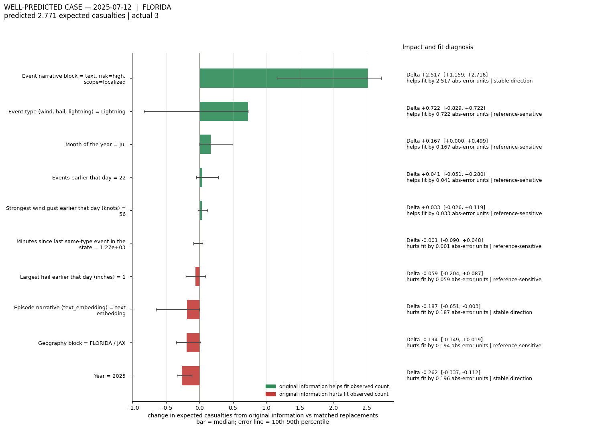

- **The same two drivers as in the failure:** the narrative block (+2.52, stable direction) and the event type, lightning (+0.72).
- **The year lowers the prediction here too** (−0.26, stable direction), as do the geography block and the episode narrative (−0.19 each).

**Internal routing: where the information travels inside the model**


- **The narrative block has the largest share again:** 29.0% in the left panel and 24.0% in the middle one.
- **Attention and impact do not match.** The geography block receives 17.5% of the decoder attention and its effect on the prediction is small and negative (−0.19). The event type adds 0.72 with 1.2% of the decoder attention, and appears in the left panel instead, through the encoder (9.5%).

**Q/K/V: what the model selects and what it passes on**

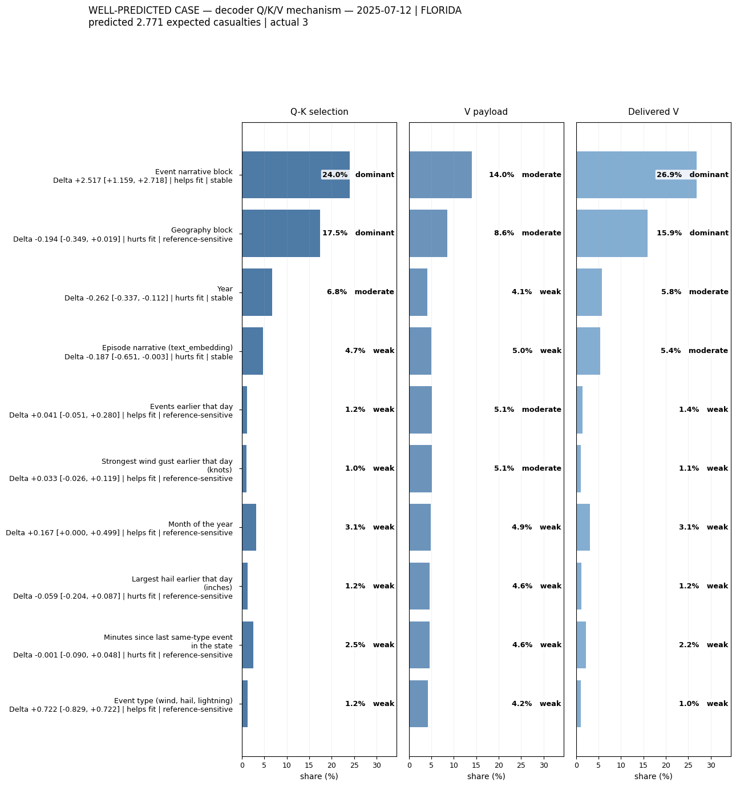

- **The narrative block delivers the most (26.9%),** from 24.0% of the selection and 14.0% of the content. The geography block follows (15.9%).
- **The event type delivers 1.0%:** the decoder hardly selects it (1.2%), as in the failure.

#### Conclusions

These draw on all six events explained in the notebook, not only on the two shown above.

- **The event narrative block is what the model depends on most,** over the whole year and in the single events: it is the largest driver in all six explained events.
- **The same kind of event, a different size.** In the four explained events where lightning is among the main drivers, the model predicts between 2 and 3 casualties. That is right when three people are hit and far short when twenty are.
- **The three failures are single incidents with many victims:** 28, 20 and 14 casualties recorded against 0.32, 2.10 and 0.29 predicted.
- **The year lowers every prediction.** In all six events, being in 2025 takes something off the prediction with a stable direction: the model associates recent years with fewer casualties per event.
- **Attention is not importance.** The event type is the second driver of both events shown and receives almost no decoder attention.

### Results: Tornado

#### The whole year

**Whole-year check: which information the model needs most**

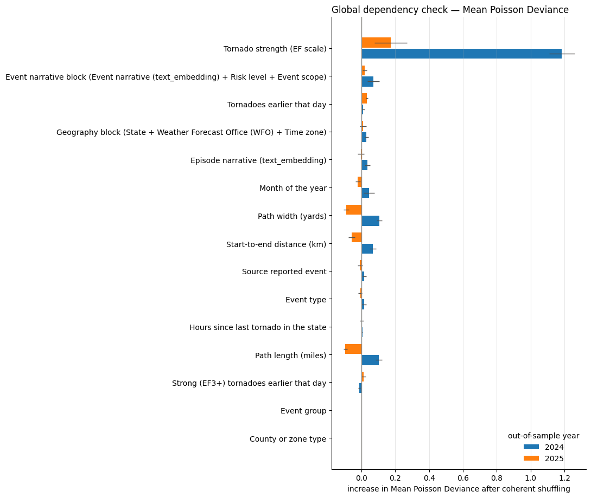

- **The EF scale comes first, far ahead of everything else.** The EF (Enhanced Fujita) scale rates a tornado's strength from EF0 to EF5. In 2024 its bar dwarfs every other one: without the rating the error grows enormously.
- **2025 behaves differently from 2024.** The bar of the EF scale is much shorter in 2025 than in 2024, so the rating helped far less that year.
- **Some 2025 bars point to the left of zero:** for path width, path length and distance, scrambling makes the 2025 predictions slightly better. What the model learned about a tornado's size did not hold that year.

#### Failure: Mississippi, 15 March 2025, EF4 (11 casualties recorded, 46.1 predicted)

**Local impact: what pushed this prediction up or down**

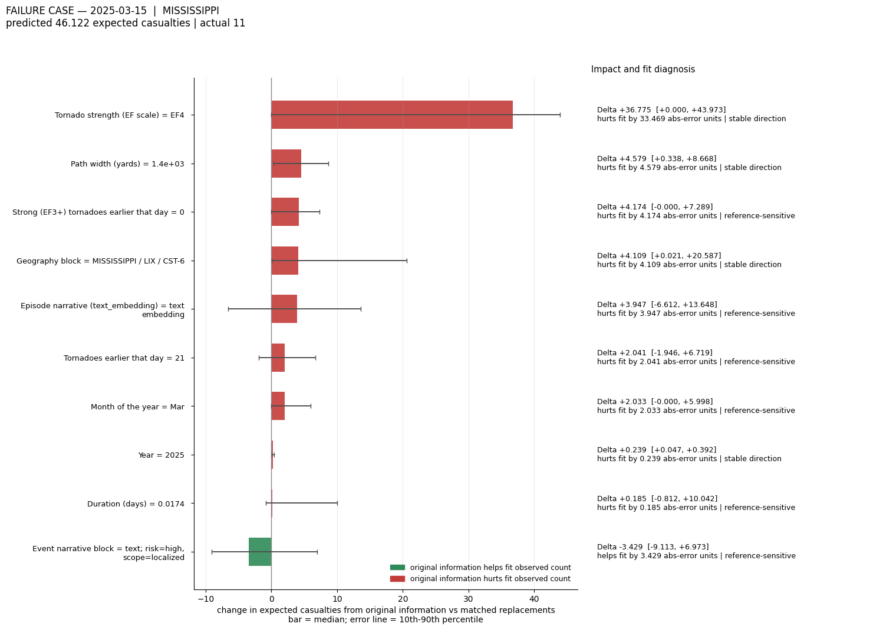

- **The EF4 rating alone explains the excess.** With the rating of similar past tornadoes in its place, the prediction falls by 36.8 of the 46.1. Path width (1,400 yards) adds 4.6 and the geography block 4.1.
- **Almost every bar is red:** each piece of information pushes the prediction further above the recorded count. The only one pulling it down is the event narrative block (−3.4).

**Reconciliation: how the prediction is built, step by step**

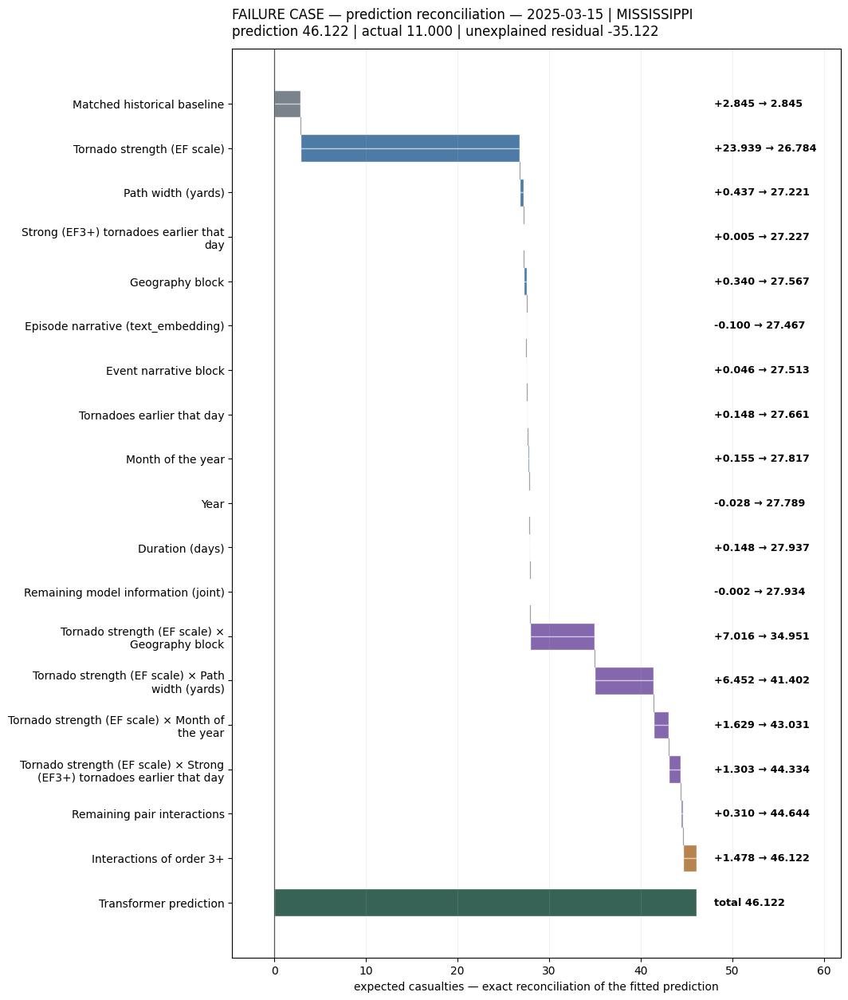

- **Similar past tornadoes are predicted at 2.8.** The EF4 rating alone adds 23.9. No other single piece of information adds more than 0.5.
- **Then come the pairs with the EF rating:** with the geography block (+7.0), with path width (+6.5), with the month (+1.6) and with the strong tornadoes earlier that day (+1.3).
- **The model is 35.1 casualties above the recorded count,** shown in the title of the chart as the model's error.

**Internal routing: where the information travels inside the model**

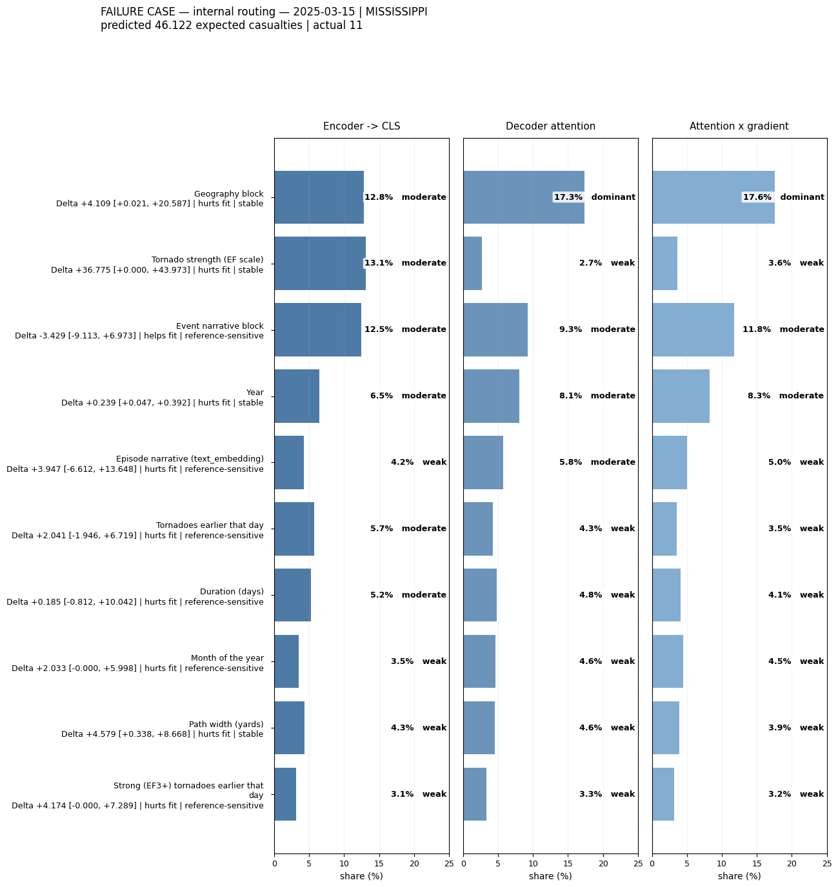

- **The clearest case of attention not being importance.** The EF scale changes the prediction by 36.8 casualties and receives 2.7% of the decoder attention (middle panel). It appears in the left panel instead, through the encoder (13.1%).
- **The geography block receives the most decoder attention** (17.3%), and it changed the prediction by 4.1.

**Q/K/V: what the model selects and what it passes on**

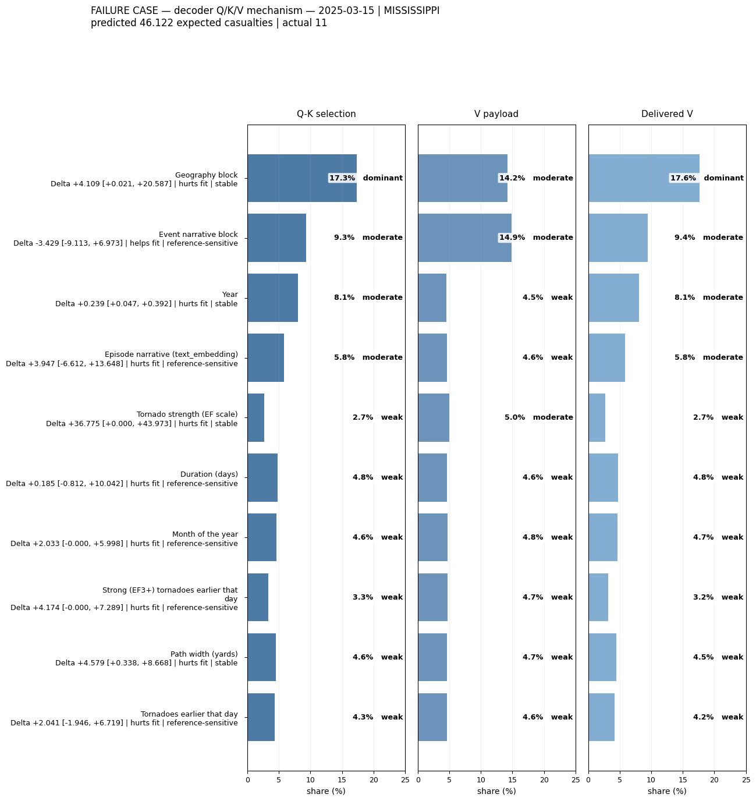

- **The EF scale is hardly selected (2.7%) and delivers 2.7%,** the smallest share of the ten pieces of information.
- **The geography block delivers the most (17.6%),** followed by the narrative block (9.4%) and the year (8.1%).

#### Well-predicted: Alabama, 15 March 2025, EF3 (4 casualties recorded, 2.68 predicted)

**Local impact: what pushed this prediction up or down**

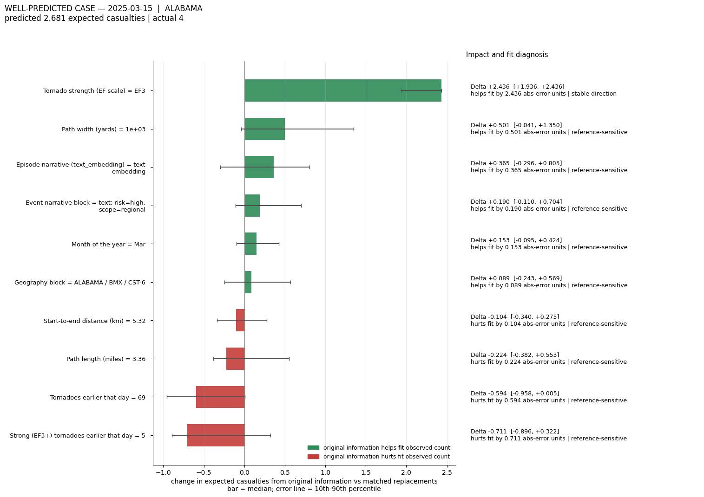

- **The EF rating again:** EF3 supplies 2.44 of the 2.68, with a stable direction. Path width (1,000 yards) adds 0.50.
- **The tornadoes earlier that day lower the prediction** (−0.59, and −0.71 for the strong ones). They are red: they take it further below the recorded count.

**Internal routing: where the information travels inside the model**

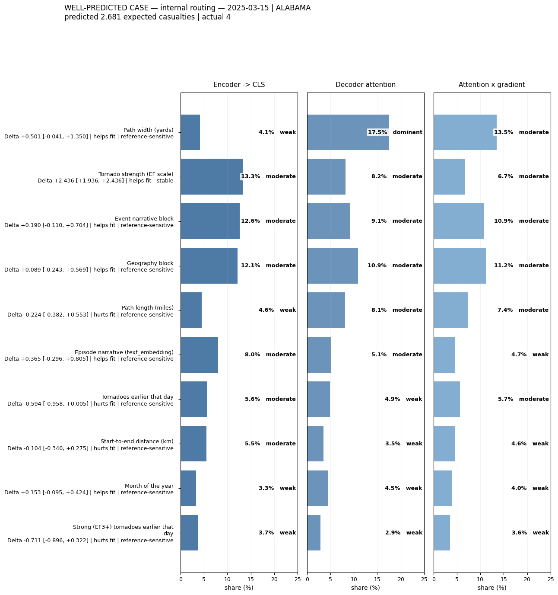

- **The same pattern as in the failure.** The EF scale has the largest share in the left panel, through the encoder (13.3%), and receives 8.2% of the decoder attention.
- **Path width receives the most decoder attention** (17.5%), and it changed the prediction by 0.50, against 2.44 for the EF rating.

**Q/K/V: what the model selects and what it passes on**

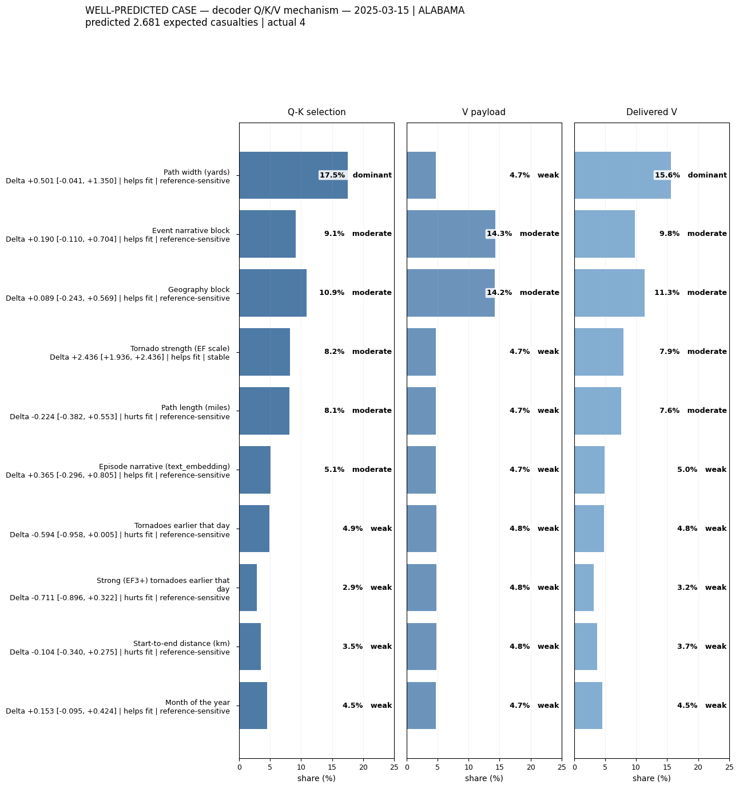

- **Path width delivers the most (15.6%)** although its content is small (4.7%): it is the most selected (17.5%).
- **The EF scale delivers 7.9%,** less than path width, the geography block and the narrative block.

#### Conclusions

These draw on all six events explained in the notebook, not only on the two shown above.

- **The EF scale is what the model depends on most,** over the whole year and in the single events: it is the largest driver in five of the six explained events.
- **The same day, the same driver, one step lower on the scale.** The rule "stronger tornado, more casualties" gives the right answer for the EF3 tornado and an answer far too high for the EF4 one.
- **The failures go both ways.** Two EF4 tornadoes are predicted far too high (46.1 against 11 recorded, 47.9 against 17). One tornado recorded as EF0 is predicted at 0.05 against 42 recorded: the model follows the rating.
- **The EF rating acts on its own and in pairs,** not through large combinations as on the other two groups.
- **Attention is not importance.** The information with by far the largest effect on the prediction receives almost no decoder attention.

### What the three groups have in common

- **One kind of information leads in each group,** the event narrative block on the global and thunderstorm groups and the EF scale on tornado, and the single events and the whole-year check agree on it.
- **The same driver produces the successes and the failures.** It gets ordinary events right and misses the extreme ones: too low when an event is far larger than its description suggests, too high when a strong tornado causes few casualties.
- **Attention is not importance.** Information with a large effect can receive almost no attention: the EF4 rating moves a prediction by 36.8 casualties with 2.7% of the decoder attention, the lightning event type by 1.45 with 0.2%. Ranking information by attention would have given the wrong answer.
- **The decoder delivers what is both selected and rich in content.** Information that is selected but carries little content, or the reverse, delivers less than its attention share suggests.

## Data files

The `data/` folder contains two datasets, each split into Parquet parts (zstd-compressed) to respect GitHub's file-size limits:

- **`StormEvents_part_1..5.parquet`** The raw merged dataset (output of step 2).
- **`StormEvents_fe_ep_augmentation_fin_update_part_1..15.parquet`** The final dataset with generated narratives, embedding features, and the LLM-derived columns `risk` and `event_scope` (output of step 6, without `impact_type`).

To reassemble a dataset, concatenate its parts in order:

```python
import glob
import pandas as pd

parts = sorted(glob.glob("data/StormEvents_fe_ep_augmentation_fin_update_part_*.parquet"))
df = pd.concat([pd.read_parquet(p) for p in parts], ignore_index=True)
```
Compiled with the assistance by Claude Code
